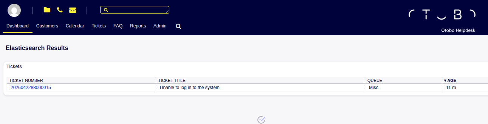

Elasticsearch
=============

Search with Elasticsearch is especially useful when:

- the exact search terms are not known
- results are needed based on partial or approximate terms
- large amounts of information must be searched
- faster and more relevant results are required

For example, an item can be found even if:

- only part of the name is entered
- small spelling mistakes are made
- similar words are used

Use this input box to search for something using the Elasticsearch's powerful features.

   Elasticsearch Input Box

If the search has results, a new pop-up screen will open.
The *Search Results* screen is available by pressing the *Enter* key in the input box.

   Elasticsearch Results Screen

By default, Elasticsearch uses a greedy wildcard search.
As long as one or more simple search terms are entered, it will perform a greedy match as if they were surrounded with wildcard asterixes ('*').

When Extended Syntax is used, the search behavior is no longer greedy by default.

This occurs when any of the following are present:

- Boolean operators: ``AND``, ``OR``, ``NOT``
- Parentheses used to group Boolean expressions
- Field-specific search using ``:`` to specify the field to search in

.. note::

    Boolean operators may be used in the extended syntax.
    Always write Boolean operators in capital letters.

In these cases, the search does not automatically perform wildcard (``*``) matching.

To restore greedy behavior, asterisks (``*``) can be manually added to the query string.
Example queries using the Extended Search syntax:

::

   Title:Test* AND Body:Test*

   (Title:Test* AND Body:Test*) AND NOT From:Azure*

   Firstname:mike AND Lastname:Moser

   CompanyName:microsoft

Available Search Terms
----------------------

A default installation of OTOBO with Elasticsearch enabled comes with the following available fields that can be searched for using the extended search syntax:

**Ticket:**

- Title
- TicketNumber
- From (Article)
- To (Article)
- Body (Article)
- Subject (Article)
- Filename (Attachment)
- Content (Attachment)

**CustomerCompany:**

- CustomerID
- CompanyName
- CompanyURL
- CompanyStreet
- CompanyZIP
- CompanyCity
- CompanyCountry
- CompanyComment

**CustomerUser:**

- Firstname
- Lastname
- Email
- Login
- UserCustomerID

**ConfigItem:**

- Name
- Number

**FAQ (with FAQ module):**

- Title (FAQ)
- Keywords
- Symptom
- Problem
- Solution

Note: For historical reasons, the search fields 'Symptom', 'Problem', and 'Solution' are named 'Field1', 'Field2', and 'Field3'
internally.
'Symptom', 'Problem', and 'Solution' will thus be translated behind the scenes.

Note: As 'Title' is also a valid search term for Ticket, a pseudo search term 'FAQ' is available so that it will search only for FAQ titles.

DynamicFields
-------------

Dynamic fields can be searched using their full name:

As an example, a DynamicField named ``DynamicField_ExampleText`` could be queried like this:

``DynamicField_ExampleText:SomeValue*``

A shortcut exists:

``@ExampleText:SomeValue*``

Search Parameters
-----------------

The query string consists of *terms* and *operators*.
A term can be a single word or a phrase surrounded by double quotes.
Operators allow to customize the search.

Single word
   If the query string is a single word (for example ``quick`` or ``brown``), then OTOBO searches for all items containing the given word.

   If two or more words are given in the query string (for example ``quick brown``), then OTOBO searches for all items containing the word ``quick`` **or** ``brown``.

Phrase surrounded by double quotes
   If the query string contains a phrase surrounded by double quotes (for example ``"quick brown"``), then OTOBO searches for all items containing the words in the phrase in the same order.

Wildcards
   The question mark ``?`` replaces a single character, and the asterisk ``*`` replaces zero or more characters (for example ``qu?ck bro*``).

   .. note::

      Wildcard queries can lead to performance issues because many terms need to be queried to match the query string.

Regular expressions
   Regular expression patterns can be embedded in the query string by wrapping them in slashes (for example ``/joh?n(ath[oa]n)/``).

   .. seealso::

      The supported regular expression syntax is explained in `Regular expression syntax <https://www.elastic.co/guide/en/elasticsearch/reference/current/query-dsl-regexp-query.html#regexp-syntax>`__ chapter of the Elasticsearch documentation.

Fuzziness
   It is possible to search for terms that are similar to, but not exactly like the given search terms, using the *fuzzy* operator (for example ``quikc~ brwn~ foks~``).

   The default fuzziness level is 2, but a level 1 should be sufficient to detect about 80% of misspellings.
   It can be specified as ``quikc~1``.

   Fuzziness can be disabled with ``quikc~0`` which will not consider spelling errors.

Proximity
   A query string like ``"quick fox"`` searches the words in exactly the same order, but the proximity search allows some other words to be included between the given words (for example ``"fox quick"~5``).

   This operator specifies the maximum edit distance of words.
   The phrase *quick fox* would be considered more relevant than *quick brown fox*.

Ranges
   The query string can contain ranges for date, numeric or string fields.
   Inclusive ranges are specified with square brackets ``[min TO max]`` and exclusive ranges are specified with curly brackets ``{min TO max}``.

Boosting
   The *boost* operator ``^`` can be used to make one term more relevant than another.
   For example, the query string ``quick^2 fox``, finds all documents about foxes, but with special interest in quick foxes.

   Boosts can also be used for phrases or groups, for example ``"quick fox"^2 AND (brown lazy)^4``.

Boolean operators
   The query string ``quick brown fox`` searches for all items containing one or more of the specified words.

   The preferred operators are ``+`` (term must be present) and ``-`` (term must not be present).
   All other terms are optional.

   For example if the query string is ``quick brown +fox -news`` then it means:

   - ``fox`` must be present.
   - ``news`` must not be present.
   - ``quick`` and ``brown`` are optional.

   The well known logical operators ``AND``, ``OR`` and ``NOT`` (or ``&&``, ``||`` and ``!``) are also supported.
   The query string ``((quick AND fox) OR (brown AND fox) OR fox) AND NOT news`` is identical with the previous example.

Grouping
   Changing the precedence with parentheses is possible, as in ``(quick OR brown) AND fox``.

Reserved characters
   There are some reserved characters which function as operators, and they can not be used in search queries.
   These reserved characters are: ``+ - = && || > < ! ( ) { } [ ] ^ " ~ * ? : \ /``.

   If any of these characters need to be used in search queries, then they must be escapes with a leading backslash.
   For example to search for the term *(1+1)=2*, it is required the query string ``\(1\+1\)\=2``.

.. seealso::

   More information can be found in the `Query string syntax <https://www.elastic.co/guide/en/elasticsearch/reference/current/query-dsl-query-string-query.html#query-string-syntax>`__ chapter of the Elasticsearch documentation.
