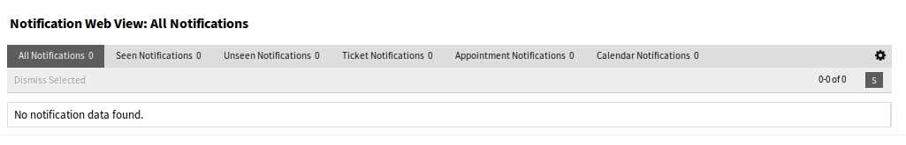

Notifications
=============

Use this screen to get an overview of notifications. The notification overview screen is available in the *Notifications* menu item of the *Avatar* menu.

If unread notifications are in this screen, a flag icon with number also indicates the number of unread notifications in the toolbar.  

   Notification Web View Screen

Notifications can be filtered by clicking on a state name in the header of the overview widget. There is an option *All Notifications* to see all notifications. The numbers after the state names indicates how many notifications are in each state.

To limit the number of displayed notifications per page and adjust visible columns:

1. Click on the gear icon in the top right corner of the overview header.
2. Select the maximum number of notifications displayed per page and set the visible columns by drag and drop.
3. Click on the *Submit* button.

.. note::

   The order of visible columns can be set by rearrange the columns in the *Visible columns* field.
