Personal Preferences
====================

Use this screen to set personal preferences in OTOBO. The personal preferences screen is available in the *Personal Preferences* menu item of the *Avatar* menu.

This overview screen consists of three modules.

- User Profile
- Notification Settings
- Miscellaneous

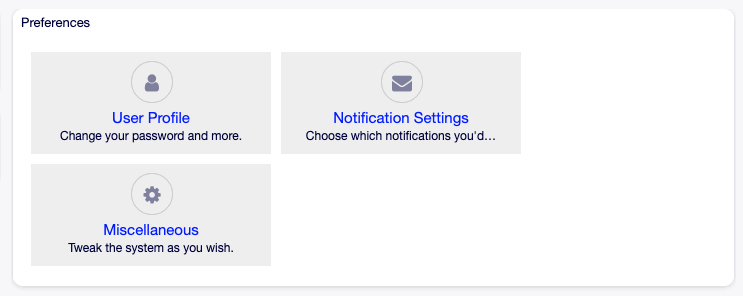

   Preferences Modules

Each module consists of widgets, which have two columns. In the first column is the setting, and in the second column is a description for the setting.

.. note::

   Do not forget to apply the changes by clicking on the tick icon in the right part of the widget.

User Profile
------------

This is the agent profile, where the account related settings can be changed.

Change password
~~~~~~~~~~~~~~~

In this widget the current password can be changed. To change the password, all fields must be filled.

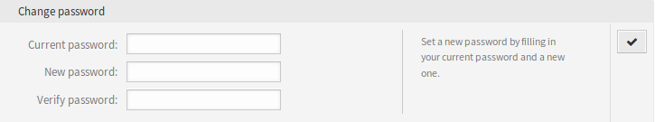

   Change Password Widget

Current password
   Type your current password for security reasons, if you want to change it.

New password
   Type your new password here.

Verify password
   Type your new password again to avoid misspelling the new password.

Google Authenticator
~~~~~~~~~~~~~~~~~~~~

.. seealso::

   System configuration ``PreferencesGroups###GoogleAuthenticatorSecretKey`` needs to be activated to use this feature.

This is a two factor authentication token described in `RFC6238 <https://tools.ietf.org/html/rfc6238>`__ to improve the account security. `Google Authenticator <https://en.wikipedia.org/wiki/Google_Authenticator>`__ is a mobile application to generate tokens, but any other generator application can be used.

.. figure:: images/preferences-user-profile-google.png
   :alt: Google Authenticator Widget

   Google Authenticator Widget

Shared Secret
   This is a string to use for token generation. It must contain only uppercase letters (A-Z) and numbers (2-7). Click on the *Generate* button to generate a secret.

   .. warning::

      Make sure that you add the shared secret to your generator application and the application works well. Otherwise you will be not able to login anymore without the two factor token.

Avatar
~~~~~~

Here can be changed the image used as avatar image in *Ticket Zoom* screen and in the main menu.

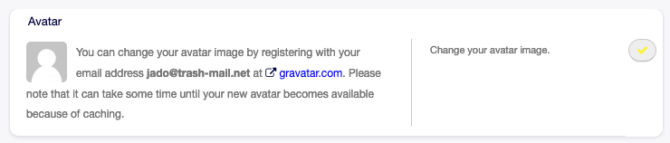

   Avatar Widget

It is not possible to upload an avatar image directly in OTOBO. You have to register your email address on `Gravatar <https://www.gravatar.com/>`__ to use this feature. Otherwise the first letters of first name and last name will be displayed.

Language
~~~~~~~~

Use this widget to set the language for the OTOBO user interface.

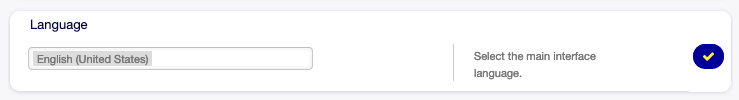

   Language Widget

Only those languages are listed by default, in which OTOBO is translated more than 95%. To see all available languages, click on the refresh icon next to the drop-down list.

.. seealso::

   Translation status of incomplete languages are low, but you can help to improve the translation. See the `developer manual <https://doc.otobo.org/manual/developer/10.0/en/content/contributing/translate.html>`__ for more information about translating OTOBO.

Time Zone
~~~~~~~~~

Each agent has to set the timezone of the current location to get proper date and time calculation in OTOBO.

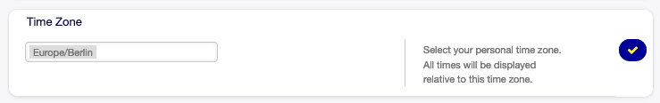

   Time Zone Widget

Select the location where you are currently in.

Out Of Office Time
~~~~~~~~~~~~~~~~~~

With this widget agents can inform other agents about absence. This is useful for resource planning and workload balancing.

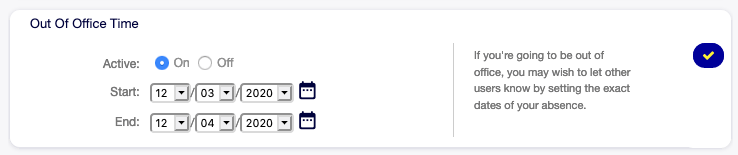

   Out Of Office Time Widget

Active
   The function can be turned on or off.

Start
   The first day of absence.

End
   The last day of absence.

Notification Settings
---------------------

These settings are for customizing personal notifications.

My Queues
~~~~~~~~~

In this widget some queues can be selected as preferred queues. Tickets in this queues will be displayed under the *Tickets in My Queues* filter of the ticket widgets, and notifications will be sent, if new tickets are available in one of the selected queues.

In :doc:`../tickets/queue-view` only those queues will be displayed under *My Queues* filter, that are selected in this widget.

In case of owner or responsible selection, only agents are listed by default as potentially owner or responsible, who are set the queue as preferred queue in this widget.

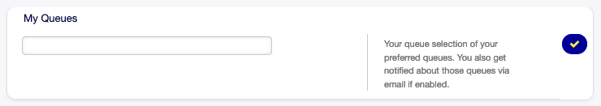

   My Queues Widget

Select one or more queues from the drop-down list.

My Services
~~~~~~~~~~~

.. seealso::

   System configuration ``Ticket::Service`` needs to be activated to use this feature.

In this widget some services can be selected as preferred services.

In :doc:`../tickets/service-view` only those services will be displayed under *My Services* filter, that are selected in this widget.

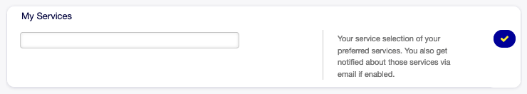

   My Services Widget

Select one or more services from the drop-down list.

Ticket Notifications
~~~~~~~~~~~~~~~~~~~~

In this widget can be selected the methods used for any kind of ticket notifications.

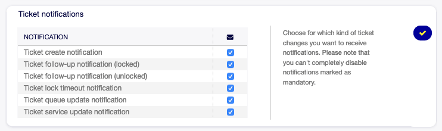

   Ticket Notifications Widget

The possible methods are *Email*, *Web View* or *SMS*.

Appointment Notifications
~~~~~~~~~~~~~~~~~~~~~~~~~

In this widget can be selected the methods used for appointment notification.

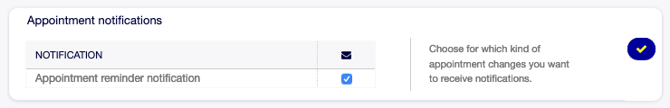

   Appointment Notifications Widget

The possible methods are *Email*, *Web View* or *SMS*.

My Chat Channels
~~~~~~~~~~~~~~~~

.. seealso::

   System configuration ``ChatEngine::Active`` needs to be activated to use this feature.

In this widget some chat channels can be selected as preferred external chat channels. You will be notified about external chat requests in these chat channels.

In :doc:`../chat/chat` screen only those chat channels will be displayed under *My Chat Channels* filter, that are selected in this widget.

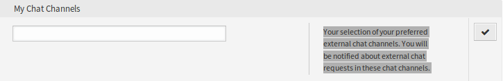

   My Chat Channels Widget

Select one or more chat channels from the drop-down list. An agent needs to select in which chat channels want to be available. Customers will only be able to create a new chat request on a certain channel if at least one agent with owner permissions has selected this channel in their preferences and is set as available for external chats by the chat availability icon in the :doc:`../dashboard/dashboard` header toolbar.

Miscellaneous
-------------

These settings are for change of visual appearance of OTOBO.

Skin
~~~~

In this widget can be selected the skin, that OTOBO should wear.

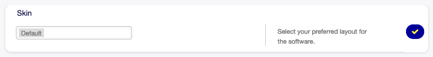

   Skin Widget

Select a skin from the drop-down list.

Overview Refresh Time
~~~~~~~~~~~~~~~~~~~~~

It is possible to make overview screens automatically refreshed after a period of time.

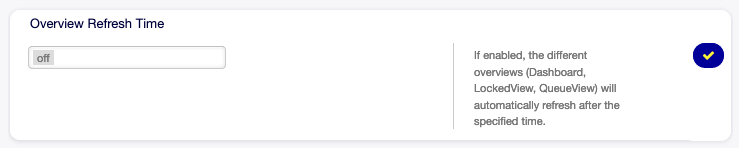

   Overview Refresh Time Widget

Select a refresh interval from the drop-down list.

.. warning::

   Refreshing the overview screens too often can cause performance issues on large systems with many agents.

Screen after new ticket
~~~~~~~~~~~~~~~~~~~~~~~

Select, which screen should be shown after a new ticket has been created.

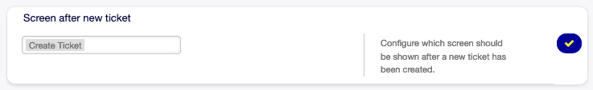

   Screen After New Ticket Widget

Select a screen from the drop-down list.

Advanced
--------

In this module can be configured some system configuration options.

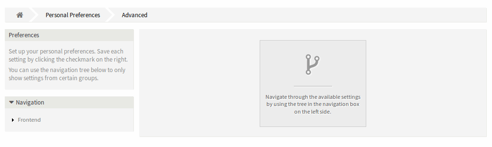

   Advanced Preferences Screen

To modify a setting:

1. Use the tree navigation in the left sidebar to find the desired setting.
2. Modify the value.
3. Click on the tick button in the right side of the setting widget.

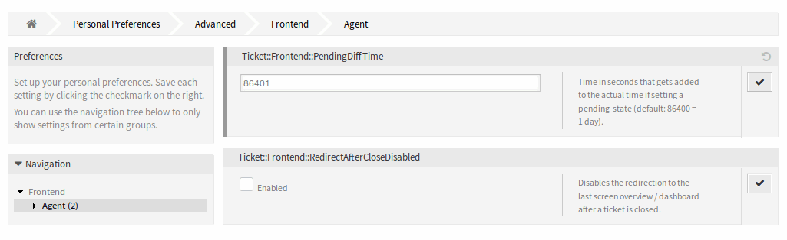

   Advanced Preferences - Tree navigation Screen

The modified settings have a gray border on the left.

To reset a setting:

1. Click on the reset icon in the top right corner of the setting widget.
