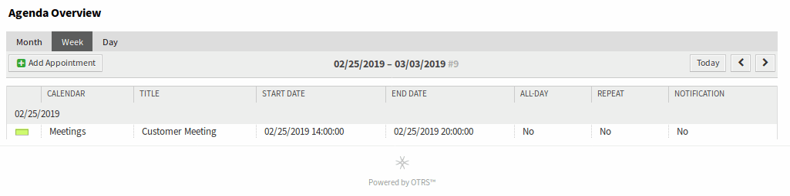

Agenda Overview
===============

Within the agenda overview, an agent is able to display the appointments of all available (accessible) calendars in a table-like overview. This overview is designed to have a detailed list of upcoming appointments in a structured table. Like in :doc:`calendar-overview` appointments can be created, edited or deleted.

.. note::

   There are no calendars added by default. Please contact your administrator to add one ore more calendars.

   .. figure:: images/calendar-no-calendar-table.png
      :alt: No Calendars Found

      No Calendars Found

This overview supports a monthly, weekly and daily point of view on available appointments.

   Agenda Overview Screen
