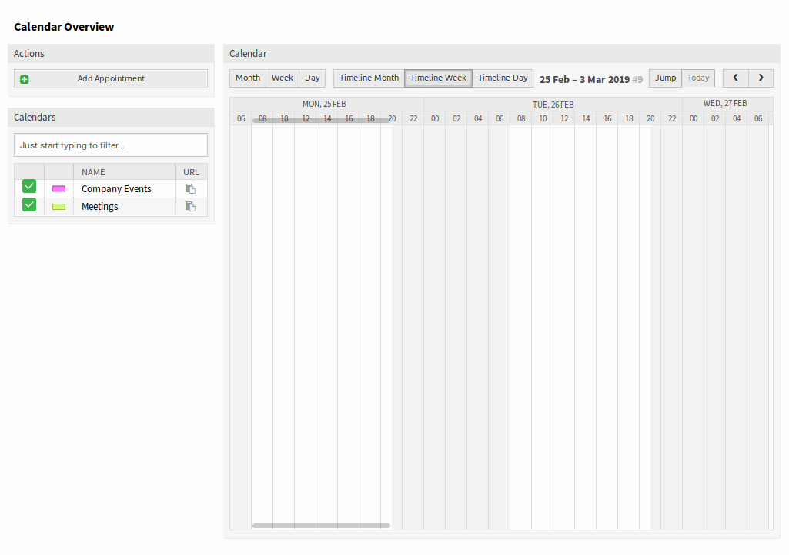
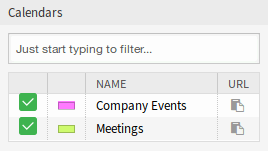
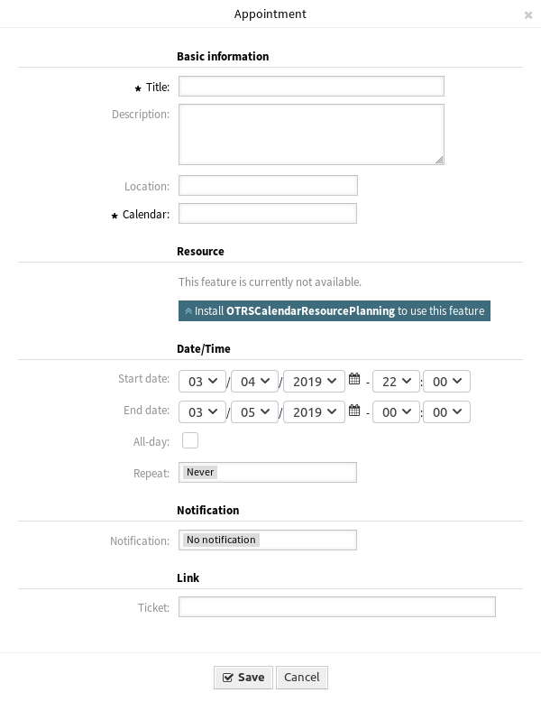
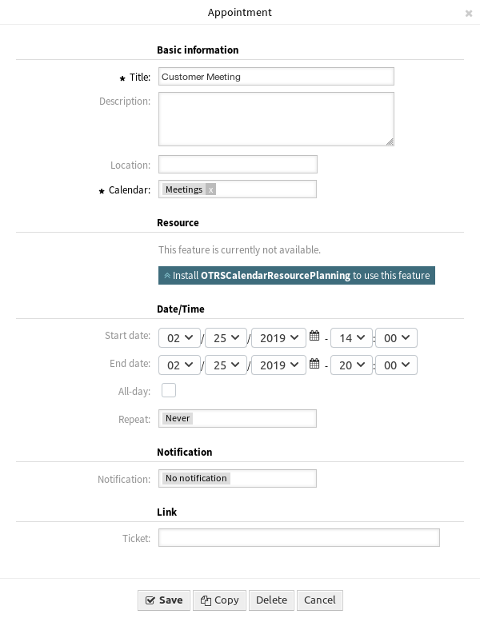

Calendar Overview
=================

Use this screen to get an overview of the added calendars. The overview screen is available in the *Calendar Overview* menu item of the *Calendar* menu.

.. note::

   There are no calendars added by default. Please contact your administrator to add one ore more calendars.

   .. figure:: images/calendar-no-calendar.png
      :alt: No Calendars Found

      No Calendars Found

This overview works the same like usual calendars. Different time periods and timelines can be selected to view appointments, and it is possible to jump between different periods.

   Calendar Overview Screen

Check or uncheck the checkboxes in the *Calendars* widget to show or hide appointments in a specific calendar.

   Calendars Widget

To view appointments in external calendar applications:

1. Click on the *Copy public calendar URL* icon in the last column of *Calendars* widget to copy the URL to clipboard.
2. Open your external calendar application.
3. Insert the URL into your external calendar application.

.. note::

   If several calendars are added to the system, use the filter box to find a particular calendar by just typing the name to filter.

Within the calendar overview, an agent is able to display, create, edit and/or delete appointments of different calendars, depending on their permission level to the related calendars. Such appointments can be created or edited via drag and drop within this screen.

To add a new appointment:

1. Click on the *Add Appointment* button in the left sidebar.
2. Fill in the required fields.
3. Click on the *Save* button.

.. seealso::

   The *Appointment* dialog is explained in :doc:`new-appointment` chapter.

   Appointment Dialog

To edit an appointment:

1. Click on an appointment in the calendar overview.
2. Modify the fields.
3. Click on the *Save* button.

   Edit Appointment Dialog

To copy an appointment:

1. Click on an appointment in the calendar overview.
2. Click on the *Copy* button.

To delete an appointment:

1. Click on an appointment in the calendar overview.
2. Click on the *Delete* button.
3. Click on the *OK* button in the confirmation dialog.
