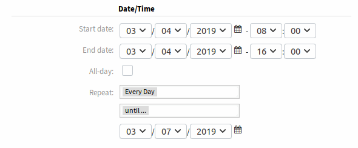
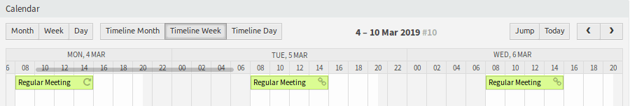
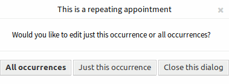

New Appointment
===============

Use this menu item to add new appointments to calendars. New appointments can be also added by clicking on the *Add Appointment* button either in :doc:`calendar-overview` or in :doc:`agenda-overview` screens. It is also possible to drag over a range of the calendar widget to setup a rough time span. Right after that, a dialog appears where the data can be inserted.

.. figure:: images/calendar-new-appointment.png
   :alt: Appointment Dialog

   Appointment Dialog

Appointment Settings
--------------------

The following settings are available when adding or editing this resource. The fields marked with an asterisk are mandatory.

Title \*
   The name of this resource. Any type of characters can be entered to this field including uppercase letters and spaces. The name will be displayed in the overview table.

Description
   Add additional information to this resource. It is recommended to always fill this field as a description of the resource with a full sentence for better clarity.

Location
   If the location contains a value, a related link icon will show up next to the field which by default links to Google map to get a better picture of the location.

   .. seealso::

      This link is configurable through the system configuration option ``AgentAppointmentEdit::Location::Link``.

Calendar \*
   Select the calendar to whom the appointment will be added to.

Resource

.. note:: Rother OSS TODO: This feature will be included in one of the next OTOBO releases. If you need it beforehand, please contact sales@otobo.de, we will find a solution.

Start date
   The start date of the appointment.

End date
   The end date of the appointment.

All-day
   This checkbox indicates that the appointment takes place on the whole day. If it is checked, time of the start date and the end date will be disabled and set to 00:00.

Repeat
   Define appointment recurrences and will be described separately, see *Repeating Appointments* below.

Notification
   Define time periods an appointment notification should be sent before the appointment start.

   .. seealso::

      Appointment notifications can be set in admin interface. Please contact your administrator.

Ticket
   Tickets and other objects can be linked to the appointment with this search field.

   .. note::

      Usage of wildcards (\*) is also possible. Enter two asterisks (\*\*) to list all tickets.

Repeating Appointments
~~~~~~~~~~~~~~~~~~~~~~

If appointments need to be created in a recurring manner, it is possible to setup detailed information about the occurrences of an appointment.

To create repeating appointments:

1. Select *Start date* and *End date* (or check *All day*).
2. Select from the pre-defined frequencies of the occurrences or choose *custom* settings.
3. Choose either a date to repeat until or an amount of times to repeat.

   Repeating Appointments

After all decisions are made and the settings are saved successfully, the appointment will be marked as recurring appointment. The parent appointment will be marked with circle-arrow-symbol and the child appointments with a chain-symbol.

   Repeating Appointments Overview

Future changes to the parent appointment will affect the children automatically, without any further message. If an agent is about to change one of the child appointments, a message will ask what would they like to update.

   Edit Repeating Appointment

If *All occurrences* going to be updated, the behavior will be the same as with the update of the parent appointment. All options (including the recurring settings) are changeable.

If *Just this occurrence* will be updated, it is not possible to change the repeating settings, but a related message and a link to the parent appointment will be provided.

The enabled repeating option will be additionally displayed in the tool-tip of the related appointments.
