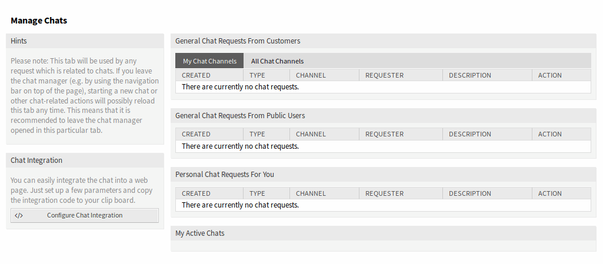
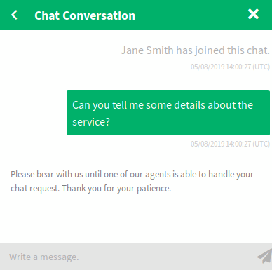
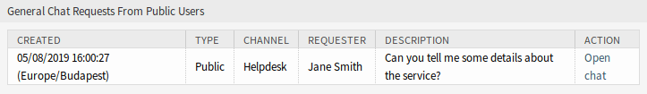
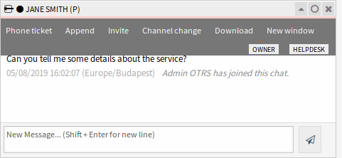

Manage Chats
============

.. note:: Rother OSS TODO: This feature will be included in one of the next OTOBO releases. If you need it beforehand, please contact sales@otobo.de, we will find a solution.

.. seealso::

   System configuration ``ChatEngine::Active`` needs to be activated to use this feature.

The chat management screen is the central point of the chat feature. Here an agent can manage the chats as well as see and accept open requests. This screen provides a list of chat requests from customer users, public users and other agents, as well as an overview over all active chats.

Use this menu item to manage chats. The chat management screen is available in the *Chat* menu.

   Chat Management Screen

Each chat channel can be filtered with the options in the top of the widget to list *All Chat Channels* or only *My Chat Channels* set in :doc:`../avatar/personal-preferences`.

Start New Chat
--------------

A chat participant can be an agent, a customer user or a public user.

Agent to Agent
~~~~~~~~~~~~~~

To start a chat with another agent:

1. Use the *Logged-In Users* widget in the dashboard. Agents who are able to use the chat, will have a chat icon next to their name.

   .. figure:: images/chat-logged-in-agents.png
      :alt: Available Agents

      Available Agents

2. Click on the chat icon next to an agent name.
3. Write the first message to the *Start Chat* dialog and send the message.

   .. figure:: images/chat-agent-to-agent-start.png
      :alt: Start Chat Dialog

      Start Chat Dialog

4. After the chat request has been sent to the other agent, watch the chat in the chat management screen. A browser notification is displayed to inform the agent.

   .. figure:: images/chat-agent-my-active-chats.png
      :alt: My Active Chats Widget

      My Active Chats Widget

5. Wait for the answer. The other agent has to accept the chat request with the *Open Chat* link.

   .. figure:: images/chat-personal-chat-request.png
      :alt: Personal Chat Requests For You Widget

      Personal Chat Requests For You Widget

6. When the other agent accepts the chat request, you can chat now.

   .. figure:: images/chat-agent-to-agent-chat.png
      :alt: Agent to Agent Chat

      Agent to Agent Chat

Agent to Customer User
~~~~~~~~~~~~~~~~~~~~~~

To start a chat with a customer user:

1. Use the *Logged-In Users* widget in the dashboard. Customer users who are able to use the chat, will have a chat icon next to their name.

   .. figure:: images/chat-logged-in-customers.png
      :alt: Available Customer Users

      Available Customer Users

   .. seealso::

      Customer users can also be selected in *Customer User Information Center* or from the *Customer Information* widget of the *Ticket Zoom* screen.

2. Click on the chat icon next to a customer user name.
3. Write the first message to the *Start Chat* dialog and send the message.

   .. figure:: images/chat-agent-to-agent-start.png
      :alt: Start Chat Dialog

      Start Chat Dialog

4. After the chat request has been sent to the other agent, watch the chat in the chat management screen. A browser notification is displayed to inform the agent.

   .. figure:: images/chat-customer-my-active-chats.png
      :alt: My Active Chats Widget

      My Active Chats Widget

5. Wait for the answer. The customer user has to accept the chat request which is displayed in the bottom right corner of the external interface.

   .. figure:: images/chat-request-external-interface.png
      :alt: Chat Request on External Interface

      Chat Request on External Interface

6. When the customer user accepts the chat request, you can chat now.

   .. figure:: images/chat-agent-to-customer-chat.png
      :alt: Agent to Customer User Chat

      Agent to Customer User Chat

7. When the customer user closes the chat, it is possible to send the chat via email or create a ticket from the conversation.

   .. figure:: images/chat-agent-to-customer-close.png
      :alt: Save the Conversation on External Interface

      Save the Conversation on External Interface

Customer User to Agent
~~~~~~~~~~~~~~~~~~~~~~

Customer users are not able to start a chat directly with a certain agent, but only to create generic chat requests.

To receive a chat request from a customer user:

1. A customer user clicked on the *New conversation* button within the chat window in the bottom right corner of the external interface.

   .. figure:: images/chat-customer-to-agent-start.png
      :alt: Start Chat Window

      Start Chat Window

2. A browser notification is displayed to inform the agent. Go to the chat management screen, and open the general chat request with the *Open chat* link.

   .. figure:: images/chat-customer-general-chat-request.png
      :alt: General Chat Requests From Customers Widget

      General Chat Requests From Customers Widget

3. Accept the chat request.

   .. figure:: images/chat-customer-to-agent-accept.png
      :alt: Chat Preview Dialog

      Chat Preview Dialog

6. When an agent accepts the chat request, they can chat now.

   .. figure:: images/chat-customer-to-agent-chat.png
      :alt: Customer User to Agent Chat

      Customer User to Agent Chat

Public User to Agent
~~~~~~~~~~~~~~~~~~~~

Visitors of the external interface are also not able to start a chat directly with a certain agent, but only to create generic chat requests. As they are not logged in, they need to add a name to start the chat.

   Start Chat Window

The steps are the same as described in *Customer User to Agent* section, but the chat request is displayed in the *General Chat Requests From Public Users* widget.

   General Chat Requests From Public Users Widget

Chat Widget
-----------

The chat widget is the main component when chatting with other people. It provides a history of all messages in the chat as well as a list of possible actions depending on your permission level.

The messages can be sent using the text field of a chat in *My Active Chats* widget by either clicking the send icon next to the text field or hitting the Enter key. Shift + Enter can be used to insert a new line into the message.

Every chat participant has a colored circle icon before his/her name in the chat widget header, which represents the participant availability.

- Green: participant is active (available and online).
- Yellow: participant is away (available, but there was no request sent to the server from this user for some time set in ``ChatEngine::AgentOnlineThreshold``).
- Pink: participant is inactive (chat request is not accepted yet or participant left the chat).
- Red: participant is unavailable (set via availability button).
- Black: participant has logged out or session has expired.

The chat widget has some icons in the top right corner.

   Chat Menu

The first triangle icon expands and collapses the chat menu. The menu has several menu items.

Phone ticket
   Allows you to create a phone ticket to which the current chat will be appended to as an article. After the ticket has successfully created, the chat will get closed automatically.

Append
   Allows you to append this chat as an article to a selected ticket. After the article has been created, the chat will get closed automatically.

Invite
   Allows you to invite another agent to this chat. You can select from a list of available agents whom you want to invite. Once the agent has invited, a new agent to agent chat request will be sent to this agent. After the request has been accepted, a new internal chat will be established between you and the invited agent. In this internal chat, the invited agent has two more actions available in the advanced actions toolbar: *Observer* and *Participant*.

Channel change
   Using this link, you can change the channel for this chat. For the selection of the target channel the same rules apply as for initially selecting a chat channel.

Download
   Lets you download the complete history of this chat as PDF.

New window
   Opens this chat in a separate popup window. You can use this window in the same way as the chat widget and both the widget and the popup can be used at the same time.

Observer
   When you have been invited to a chat by another agent, you can decide if you want to join the chat as observer or participant depending on your permission level. Once you click the action from your toolbar, a new chat widget will be added to the list of your active chats which is the chat you have been invited to.

   If you join the chat as observer, you will only be able to read what others are contributing to the chat and you will be invisible to customer users or public users. Agents will still receive a message that you joined the chat as observer.

   As an observer, you have the possibility to become a participant anytime by using the advanced action toolbar in your chat widget depending on your permission level.

Participant
   If you want to contribute something to the chat you have been invited to, you can join it as a participant. Customer users, public users and agents will receive a message that you have entered the chat. As a participant, you can become an observer anytime by using the advanced action toolbar in your chat widget.

The second circle icon allows the agent to set up a personal monitoring for this chat, which is a three-way switch:

- Empty circle: no monitoring.
- Empty circle with tick icon: only monitor customer user activity.
- Filled circle with tick icon: monitor all actions.

When monitoring a chat, browser notifications will show up each time there is a new action in this chat.

Finally the third close icon makes it possible to close the chat by clicking on the *X*.

Chat Integration
----------------

The public chat can be easily integrated into a website with the chat integration configuration and snippet generator.

To configure the chat and generate the code snippet:

1. Click on the *Configure Chat Integration* button in the left sidebar.
2. Customize the texts in the *Configuration* tab.

   .. figure:: images/chat-integration-configuration.png
      :alt: Chat Integration – Configuration

      Chat Integration – Configuration

   .. note::

      All changes made in the *Configuration* tab will not be saved. Every time you open this dialog, all fields will be reset to default values.

3. Copy the code snippet from the *Integration Code* tab and paste it into your website right before the ``</body>`` element.

   .. figure:: images/chat-integration-integration-code.png
      :alt: Chat Integration – Integration Code

      Chat Integration – Integration Code

4. You can check the result in the *Preview* tab.

   .. figure:: images/chat-integration-preview.png
      :alt: Chat Integration – Preview

      Chat Integration – Preview

   .. note::

      The preview uses the real chat module. Other agents have to be available for chatting to preview all features.

If mixed content warning is displayed in the browser console, an administrator has to check that the system configuration setting ``HttpType`` is properly set. The website must run on the same protocol for the chat widget to work.

For example, if the website is running OTOBO on SSL, the system configuration option must be set to ``https``.
