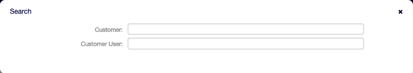
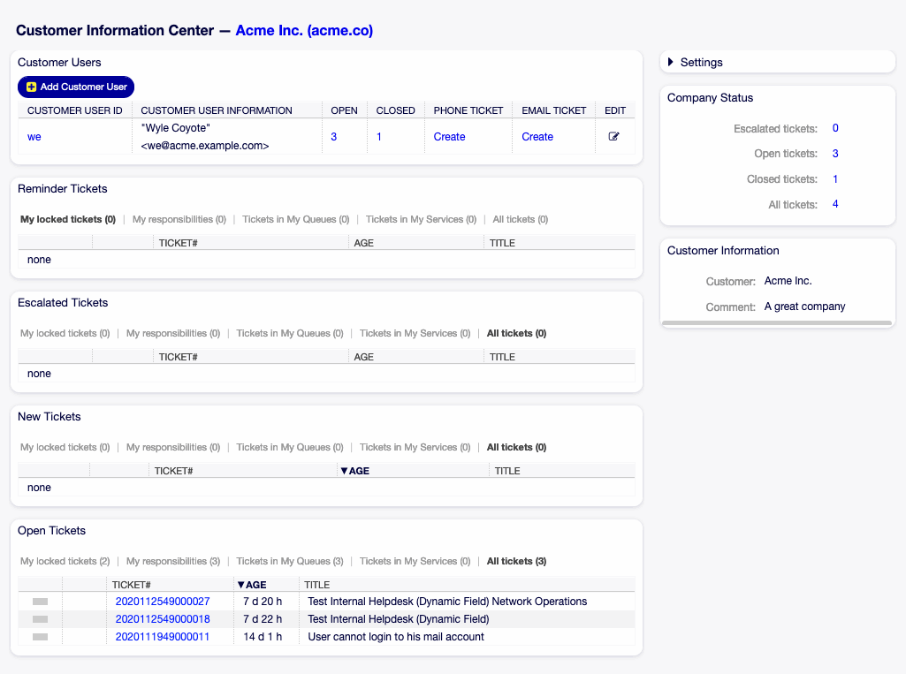
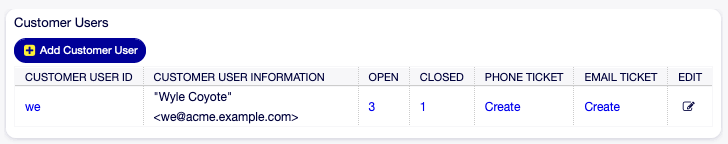
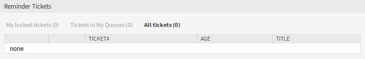
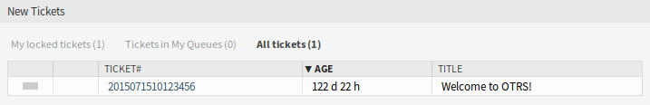
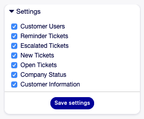
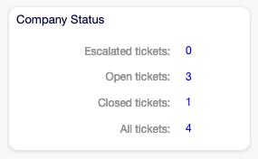
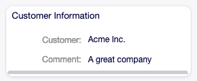

Customer Information Center
===========================

Customer information center is a dashboard, which displays all relevant tickets and customer users belong to the customer. This dashboard has the same purpose as the agent dashboard: to see all relevant information at a glance.

Use this screen to access the customer dashboard. The dashboard is available in the *Customer Information Center* menu item of the *Customers* menu.

Manage Customer Tickets
-----------------------

Clicking on the *Customer Information Center* menu item will open a modal search dialog to search for a customer or a customer user. At least two characters need to be entered here.

   Customer or Customer User Search Dialog

.. note::

   Usage of wildcards (\*) is also possible. Enter two asterisks (\*\*) to list all customers or customer users.

After a customer or a customer user is selected, the *Customer Information Center* dashboard will be opened. The dashboard contains many widgets.

.. note::

   The order of the widgets can be rearranged by drag and drop, and the widgets can be removed with the close icon on the top right corner of each widget.

.. seealso::

   See chapter :doc:`../dashboard/dashboard` for more detailed explanation of managing widgets.

   Customer Information Center Dashboard

Customer Information Center Content Widgets
~~~~~~~~~~~~~~~~~~~~~~~~~~~~~~~~~~~~~~~~~~~

The *Customer Users* widget is used to list all customer users belong to the customer. It is possible to add or edit the customer users, see the details and create tickets directly from the widget.

   Customer Users Widget

To add a new customer user:

1. Click on the *Add Customer User* button in the top of the widget.
2. Fill in the required fields.
3. Click on the *Save* button.

To edit a customer user:

1. Click on the pencil icon in the last column of the table.
2. Modify the fields.
3. Click on the *Save* or *Save and finish* button.

To see the details of a customer user:

1. Click on the name of a customer user.
2. See the customer and all relevant tickets in the :doc:`customer-user-information-center`.

To create new ticket for a customer user:

1. Click on the *Create* link in the *Phone Ticket* or *Email Ticket* column.
2. Follow the instruction in :doc:`../tickets/new-phone-ticket` or in :doc:`../tickets/new-email-ticket` screen.

To search for tickets of a customer user:

1. Click on the numbers in the *Open* or *Closed* column.
2. Find the needed ticket in the new screen.

The following widgets display tickets related to customer.

Each ticket widget has own filter for displaying:

- My locked tickets: tickets which are locked by the current agent.
- Tickets in My Queues: tickets which are in queues selected in :doc:`../avatar/personal-preferences`.
- All tickets: all tickets in this kind of widget.

The *Reminder Tickets* widget lists the pending tickets. Pending tickets are set for later work by the agent, and the reminder time is going to expire soon.

   Reminder Tickets Widget

The *Escalated Tickets* widget lists the escalated tickets. Escalated tickets are after the time set in service level agreement, and therefore needs to be worked on them immediately.

.. figure:: ../dashboard/images/dashboard-escalated-tickets.png
   :alt: Escalated Tickets Widget

   Escalated Tickets Widget

The *New Tickets* widget lists the recently created tickets. New tickets are not handled by an agent yet.

   New Tickets Widget

The *Open Tickets* widget lists the open tickets. Open tickets represent the current work done by the agent.

.. figure:: ../dashboard/images/dashboard-open-tickets.png
   :alt: Open Tickets Widget

   Open Tickets Widget

Customer Information Center Sidebar Widgets
~~~~~~~~~~~~~~~~~~~~~~~~~~~~~~~~~~~~~~~~~~~

The following widgets are located on the right sidebar. There is a *Settings* widget to turn other widgets on or off, and some information widgets also displayed here.

The *Settings* widget lists all available widgets on the screen.

   Settings Widget

To turn on or off a widget:

1. Expand the *Settings* widget in the right sidebar by clicking on its header bar.
2. Modify the checked state of a checkbox.
3. Click on the *Save settings* button.

The *Company Status* widget displays the number of tickets of the current customer categorized by state.

   Company Status Widget

The *Customer Information* widget displays information about the current customer.

   Customer Information Widget

.. seealso::

   Customer information can be changed in :doc:`customer-administration`.
