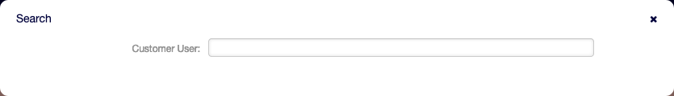
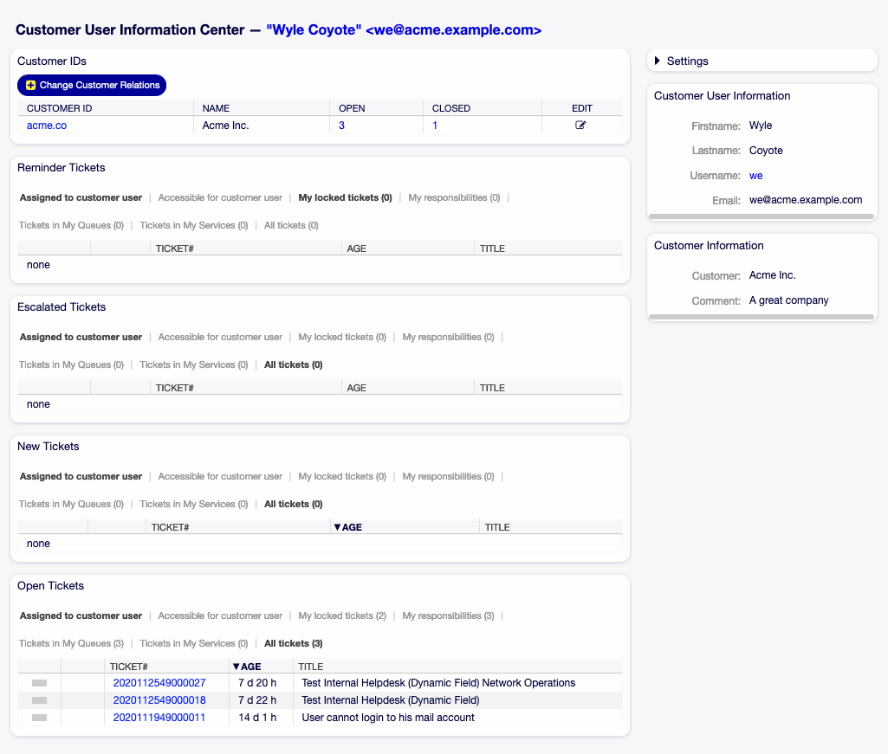
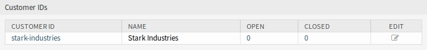
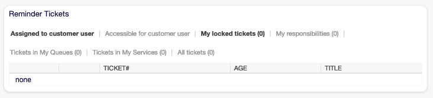
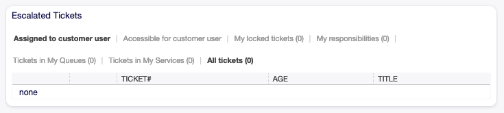
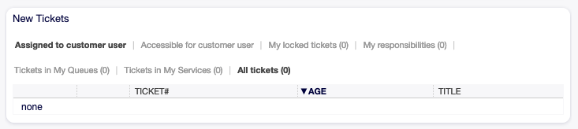
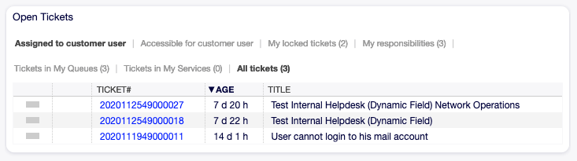
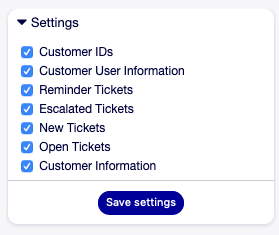
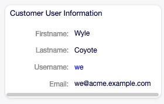

Customer User Information Center
================================

Customer user information center is a dashboard, which displays all relevant tickets and customers belong to the customer user. This dashboard has the same purpose as the agent dashboard: to see all relevant information at a glance.

Use this screen to access the customer user dashboard. The dashboard is available in the *Customer User Information Center* menu item of the *Customers* menu.

Manage Customer User Tickets
----------------------------

Clicking on the *Customer User Information Center* menu item will open a modal search dialog to search for a customer user. At least two characters need to be entered here.

   Customer User Search Dialog

.. note::

   Usage of wildcards (\*) is also possible. Enter two asterisks (\*\*) to list all customer users.

After a customer user is selected, the *Customer User Information Center* dashboard will be opened. The dashboard contains many widgets.

.. note::

   The order of the widgets can be rearranged by drag and drop, and the widgets can be removed with the close icon on the top right corner of each widget.

.. seealso::

   See chapter :doc:`../dashboard/dashboard` for more detailed explanation of managing widgets.

   Customer User Information Center Dashboard

Customer User Information Center Content Widgets
~~~~~~~~~~~~~~~~~~~~~~~~~~~~~~~~~~~~~~~~~~~~~~~~

The *Customer IDs* widget is used to list all customers to whom the customer user belongs to. It is possible to edit the customer and see the details directly from the widget.

   Customer IDs Widget

To edit a customer:

1. Click on the pencil icon in the last column of the table.
2. Modify the fields.
3. Click on the *Save* or *Save and finish* button.

To see the details of a customer:

1. Click on the name of a customer.
2. See the customer users and all relevant tickets in the :doc:`customer-information-center`.

To search for tickets of a customer:

1. Click on the numbers in the *Open* or *Closed* column.
2. Find the needed ticket in the new screen.

The following widgets display tickets related to customer user.

Each ticket widget has own filter for displaying:

- Assigned to customer user: tickets which are assigned to the customer user.
- Accessible for customer user: tickets which are accessible for customer user.
- My locked tickets: tickets which are locked by the current agent.
- Tickets in My Queues: tickets which are in queues selected in :doc:`../avatar/personal-preferences`.
- All tickets: all tickets in this kind of widget.

The *Reminder Tickets* widget lists the pending tickets. Pending tickets are set for later work by the agent, and the reminder time is going to expire soon.

   Reminder Tickets Widget

The *Escalated Tickets* widget lists the escalated tickets. Escalated tickets are after the time set in service level agreement, and therefore needs to be worked on them immediately.

   Escalated Tickets Widget

The *New Tickets* widget lists the recently created tickets. New tickets are not handled by an agent yet.

   New Tickets Widget

The *Open Tickets* widget lists the open tickets. Open tickets represent the current work done by the agent.

   Open Tickets Widget

Customer User Information Center Sidebar Widgets
~~~~~~~~~~~~~~~~~~~~~~~~~~~~~~~~~~~~~~~~~~~~~~~~

The following widgets are located on the right sidebar. There is a *Settings* widget to turn other widgets on or off, and some information widgets also displayed here.

The *Settings* widget lists all available widgets on the screen.

   Settings Widget

To turn on or off a widget:

1. Expand the *Settings* widget in the right sidebar by clicking on its header bar.
2. Modify the checked state of a checkbox.
3. Click on the *Save settings* button.

The *Customer User Information* widget displays information about the current customer user.

   Customer User Information Widget

The *Customer Information* widget displays information about the current customer.

.. figure:: images/customer-information-center-customer-information.png
   :alt: Customer Information Widget

   Customer Information Widget

.. seealso::

   Customer user information can be changed in :doc:`customer-user-administration`.
