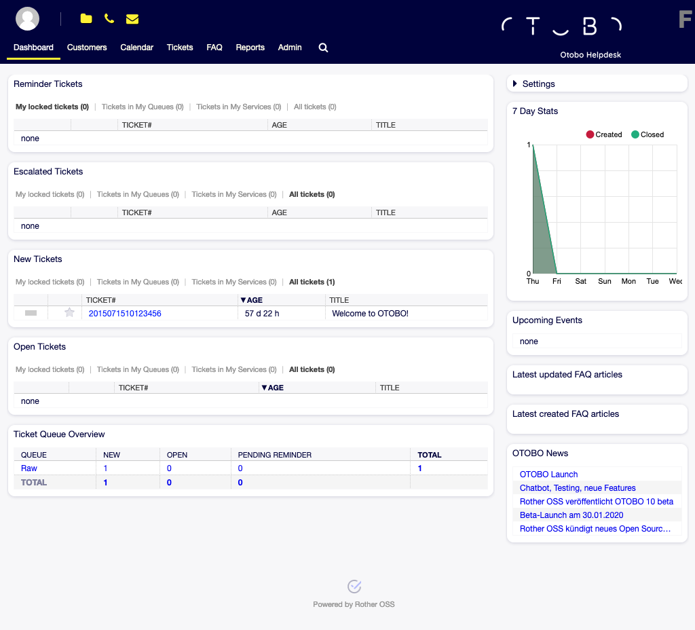

Dashboard
=========

After login to the agent interface, the agent dashboard will be displayed. This dashboard is a collection of widgets, which display customized important information for each agent.

   Agent Dashboard

The dashboard is the main page of the system, where you can get an overview of tickets and other things related to ticket activity. It is designed to be the starting point for an agent’s daily work. By default, it provides a quick summary of the tickets that are pending, escalated, new or open, and more information.

One of the most important features about dashboard is that is completely customizable. That means you that can configure each part as you want, showing or hiding elements. It is even possible to relocate this elements within the same column by clicking on and dragging the header of an element, and dropping them elsewhere. Each element is named *widget*. The system has some widgets ready to use out of the box, but the modular design of the dashboard screen is prepared to integrate custom widgets easily.

The content of this screen is arranged in two main columns, on the left column you normally can see information about tickets classified by their states like: reminder, escalated, new, and open. On each of this widgets you can filter the results to see all of the tickets that you are allowed to access, tickets you have locked, the ones that are located in agent defined queues, among other filters. There are also other kind of widgets in this column and they are all described below.

.. toctree::
   :maxdepth: 3
   :caption: Contents

   dashboard/dashboard
