Dashboard
=========

The dashboard is the main overview screen for agents. Use this screen to get full overview about the most important things: ticket lists, appointments, statistics, news.

   Dashboard Header

The header consists of three parts.

Avatar image
   The :doc:`../avatar` and the :doc:`../avatar/logout` possibilities.

Toolbar icons
   Icons with numbers indicating some ticket actions with the number of related tickets. The icons and search boxes are not activated by default.

   .. seealso::

      Icons and search boxes can be activated in settings under *Frontend* → *Agent* → *Toolbar*.

   The last icon is the chat availability status.

   .. seealso::

      System configuration ``ChatEngine::Active`` needs to be activated to use this feature.

   The chat availability status icon is a three-way switch, and can be changed by clicking.

   - Empty circle: unavailable for chats.
   - Empty circle with tick sign: available for internal (agent to agent) chats.
   - Filled circle with tick sign: available for internal (agent to agent) and external (customer to agent, public to agent) chats.

   .. note::

      The chat availability status will be changed from external chats to internal chats each time an agent logs in to OTOBO again.

Main menu
   The main menu of the agent interface.

The dashboard displays so called *widgets*. A widget is a box, that consists of a header, a filter and a data table. Each widget can be moved with drag and drop, and can have own settings.

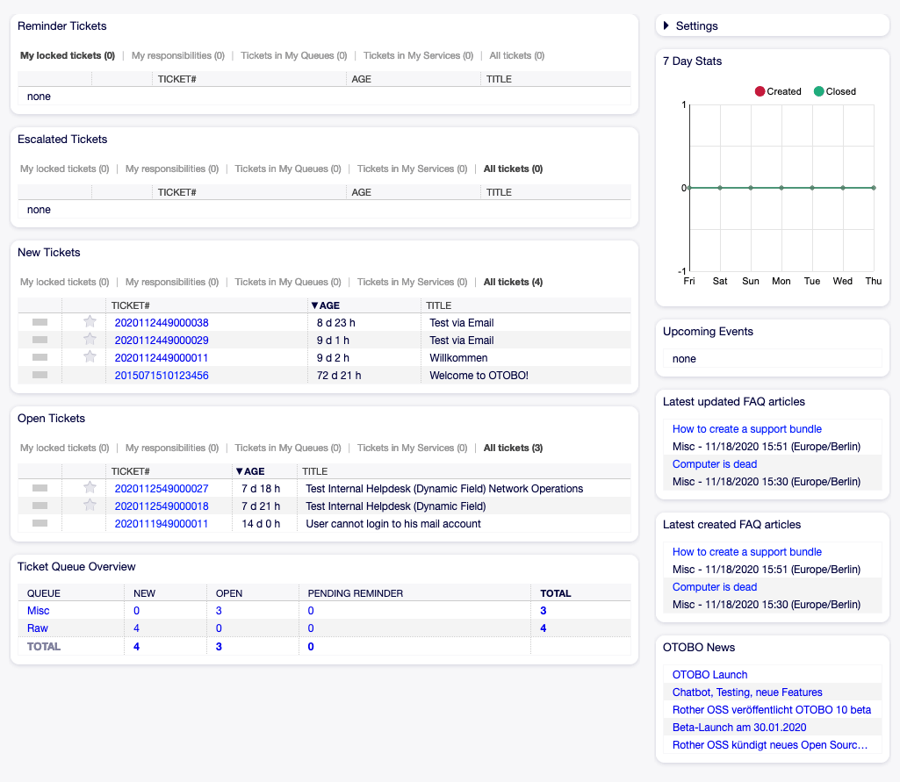

   Dashboard Widgets

Each ticket widget has own filter for displaying:

- My locked tickets: tickets which are locked by the current agent.
- My watched tickets: tickets that the agent has in his/her watched list (requires ``Ticket::Watcher`` setting to be turned on).
- My responsibilities: tickets that the agent is set as responsible (requires ``Ticket::Responsible`` setting to be turned on).
- Tickets in My Queues: tickets which are in queues selected in :doc:`../avatar/personal-preferences`.
- Tickets in My Services: tickets that are assigned to services selected in :doc:`../avatar/personal-preferences`.
- All tickets: all tickets in this kind of widget.

The numbers indicate the number of tickets in each filter term.

To add new widgets:

1. Click on the *Settings* widget in the right sidebar to expand it.
2. Select the widgets you want to add.
3. Click on the *Save settings* button.

To remove widgets:

1. Click on the *Settings* widget in the right sidebar to expand it.
2. Deselect the widgets you want to remove.
3. Click on the *Save settings* button.

.. seealso::

   You can also remove a widget, if you hover the mouse over the widget header and click on the *×* on the top right corner to close the widget.

To move widgets:

1. Click on the widget header and hold down the mouse button.
2. Drag the widget to the desired position.
3. Drop the widget by releasing the mouse button.

Widgets can have own settings. To configure a widget:

1. Hover the mouse over the widget header.
2. Click on the gear icon in the top right corner.
3. Change the number and set the visible columns by drag and drop.
4. Click on the *Save Changes* button.

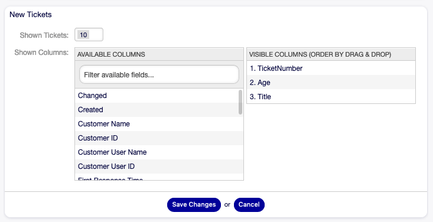

   Widget Settings

.. note::

   The order of visible columns can be set by rearrange the columns in the *Visible columns* field.

Dashboard Content Widgets
-------------------------

.. note::

   The widgets can be different depending on the installed packages and system configuration settings.

The *Reminder Tickets* widget lists the pending tickets. Pending tickets are set for later work by the agent, and the reminder time is going to expire soon.

.. figure:: images/dashboard-reminder-tickets.png
   :alt: Reminder Tickets Widget

   Reminder Tickets Widget

The *Escalated Tickets* widget lists the escalated tickets. Escalated tickets are after the time set in service level agreement, and therefore needs to be worked on them immediately.

.. figure:: images/dashboard-escalated-tickets.png
   :alt: Escalated Tickets Widget

   Escalated Tickets Widget

The *New Tickets* widget lists the recently created tickets. New tickets are not handled by an agent yet.

.. figure:: images/dashboard-new-tickets.png
   :alt: New Tickets Widget

   New Tickets Widget

The *Open Tickets* widget lists the open tickets. Open tickets represent the current work done by the agent.

.. figure:: images/dashboard-open-tickets.png
   :alt: Open Tickets Widget

   Open Tickets Widget

The *Running Process Tickets* widget lists the process tickets, that are started, but not finished yet.

.. figure:: images/dashboard-running-process-tickets.png
   :alt: Running Process Tickets Widget

   Running Process Tickets Widget

The *Ticket Queue Overview* widget gives an overview as a ticket count matrix, where the rows represent queues and the columns represent the ticket states. Each cell displays the number of tickets in a defined state that belongs to a particular queue.

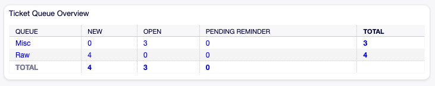

   Ticket Queue Overview Widget

The *Events Ticket Calendar* widget displays tickets in a calendar, but this widget does not work out-of-the-box.

To display the tickets in this calendar, the following settings need to be set by an **admin user**:

1. Create the following dynamic fields:

   +--------+-------------+-----------------------------+---------------------+
   | Object | Type        | Name                        | Label               |
   +========+=============+=============================+=====================+
   | Ticket | Date / Time | ``TicketCalendarStartTime`` | Calendar Start Time |
   +--------+-------------+-----------------------------+---------------------+
   | Ticket | Date / Time | ``TicketCalendarEndTime``   | Calendar End Time   |
   +--------+-------------+-----------------------------+---------------------+

2. Navigate to *Frontend* → *Agent* → *View* and select a view to add the dynamic field to.

   For example add these dynamic fields to *New Phone Ticket* screen and *New Email Ticket* screen to set the dates at ticket creation time, or to *Ticket Free Fields* screen to set the dates for existing ticket in the *Miscellaneous* → *Free Fields* menu item of the :doc:`../tickets/ticket-zoom` screen.

   - ``Ticket::Frontend::AgentTicketPhone###DynamicField``

      - ``TicketCreateStartTime`` → *1 – Enabled*
      - ``TicketCreateEndTime`` → *1 – Enabled*

   - ``Ticket::Frontend::AgentTicketEmail###DynamicField``

      - ``TicketCreateStartTime`` → *1 – Enabled*
      - ``TicketCreateEndTime`` → *1 – Enabled*

   - ``Ticket::Frontend::AgentTicketFreeText###DynamicField``

      - ``TicketCreateStartTime`` → *1 – Enabled*
      - ``TicketCreateEndTime`` → *1 – Enabled*

3. Add more queues to ``DashboardEventsTicketCalendar###Queues`` setting (default is *Raw* queue only).

If the dynamic fields contain values for the tickets, the tickets are displayed in the widget.

Hover the mouse over an entry to see the details of the ticket, or click on it to open the ticket in the :doc:`../tickets/ticket-zoom` screen.

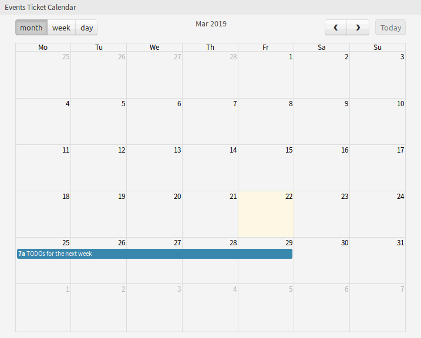

   Events Ticket Calendar Widget

Dashboard Sidebar Widgets
-------------------------

The following widgets are located on the right sidebar. There is a *Settings* widget to turn other widgets on or off, and some information widgets also displayed here.

The *Settings* widget lists all available widgets on the screen.

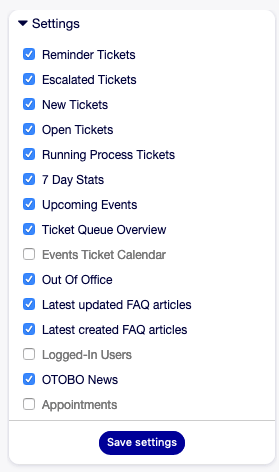

   Settings Widget

To turn on or off a widget:

1. Expand the *Settings* widget in the right sidebar by clicking on its header bar.
2. Modify the checked state of a checkbox.
3. Click on the *Save settings* button.

The *7 Day Stats* widget displays the number of created and closed tickets in the last seven days.

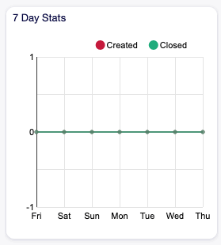

   7 Day Stats Widget

The *Upcoming Events* widget displays entries from the :doc:`../calendar`.

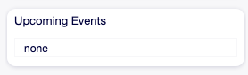

   Upcoming Events Widget

The *Out Of Office* widget displays the agents, who are currently out of office. This information can be set in the *User Profile* module of the :doc:`../avatar/personal-preferences`.

.. note::

   If currently no agents are out of office, this widget is not displayed.

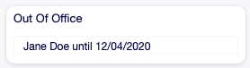

   Out Of Office Widget

The *Latest updated FAQ articles* widget displays the FAQ articles, that are updated recently.

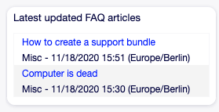

   Latest Updated FAQ Articles Widget

The *Latest created FAQ articles* widget displays the FAQ articles, that are created recently.

.. figure:: images/dashboard-latest-created-faq.png
   :alt: Latest Created FAQ Articles Widget

   Latest Created FAQ Articles Widget

The *Logged-In Users* widget displays the currently online agents and customer users.

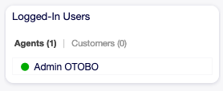

   Logged-In Users Widget

The *OTOBO News* widget displays news from an RSS feed.

.. seealso::

   To change the RSS feed source, see ``DashboardBackend###0410-RSS`` setting.

.. figure:: images/dashboard-otobo-news.png
   :alt: OTOBO News Widget

   OTOBO News Widget

The *Appointments* widget displays the appointments for today, tomorrow and for this week.

Click on the *Add Appointment* button to open the :doc:`../calendar/new-appointment` dialog.

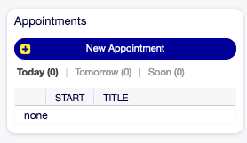

   Appointments Widget
