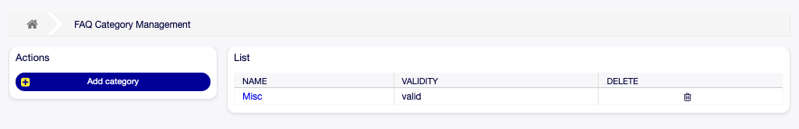
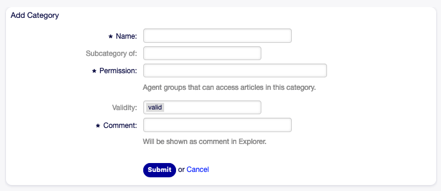
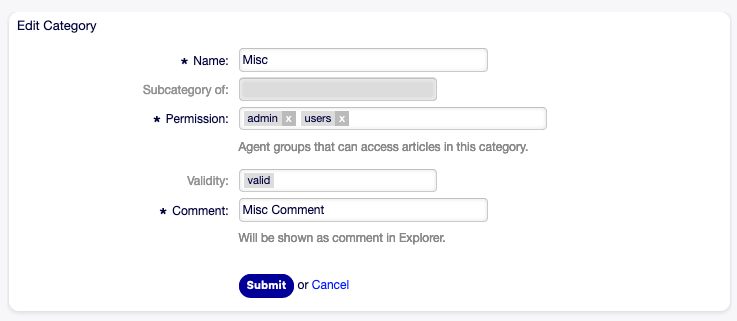
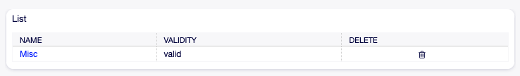

Category Management
===================

.. note::

   This menu item is only available for agents who have administrator privileges.

Use this screen to manage categories available in FAQ articles. A fresh OTOBO installation already contains a category by default. The category management screen is available in the *Category Management* menu item of the *FAQ* menu.

   FAQ Category Management Screen

Manage FAQ Categories
---------------------

To add a category:

1. Click on the *Add category* button in the left sidebar.
2. Fill in the required fields.
3. Click on the *Submit* button.

   Add Category Screen

To edit a category:

1. Click on a category in the list of categories.
2. Modify the fields.
3. Click on the *Submit* button.

   Edit Category Screen

To delete a category:

1. Click on the trash icon in the list of categories.
2. Click on the *Yes* button in the confirmation dialog.

   Delete Category Screen

FAQ Category Settings
---------------------

The following settings are available when adding or editing this resource. The fields marked with an asterisk are mandatory.

Name \*
   The name of this resource. Any type of characters can be entered to this field including uppercase letters and spaces. The name will be displayed in the overview table.

Subcategory of
   It is possible to add the new category under an existing one as sub-category. This will be displayed as *Parent Category::Child Category*.

Permission \*
   Agent groups that can access articles in this category.

Validity
   Set the validity of this resource. Each resource can be used in OTOBO only, if this field is set to *valid*. Setting this field to *invalid* or *invalid-temporarily* will disable the use of the resource.

Comment \*
   Add additional information to this resource. It is recommended to always fill this field as a description of the resource with a full sentence for better clarity, because the comment will be also displayed in the overview table.
