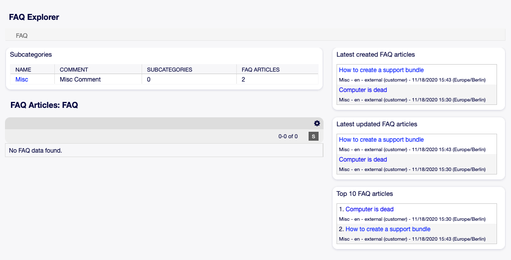
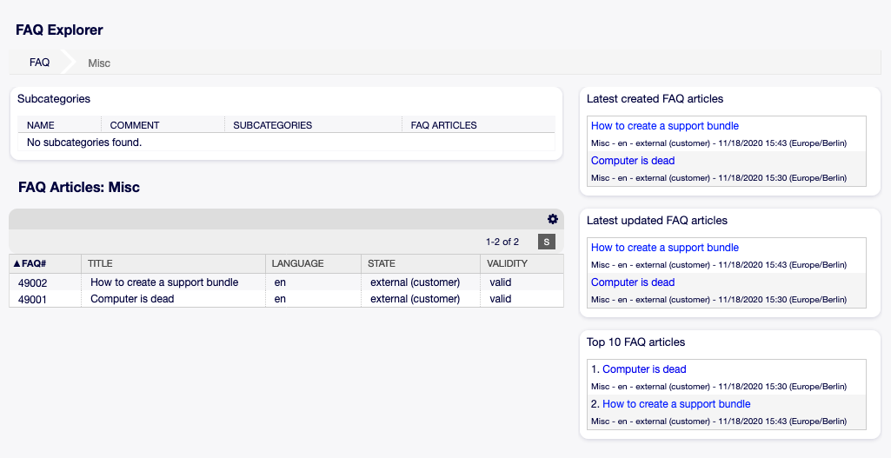
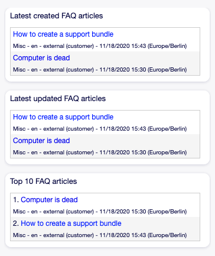

Explorer
========

Use this screen to browse through the FAQ articles. The FAQ explorer is available in the *Explorer* menu item of the *FAQ* menu.

   FAQ Explorer Screen

This screen contains several widgets.

FAQ Explorer Content Widgets
----------------------------

The *Subcategories* widget lists all categories and displays the number of subcategories and FAQ articles.

To select a category, just click on the name of a category.

If a category contains at least one FAQ article, the list of FAQ articles will display in the *FAQ Articles* widget. This widget displays some information about the FAQ articles, like *Title*, *Language*, *State* and *Validity*.

   FAQ Articles Widget

To limit the number of displayed FAQ articles per page:

1. Click on the gear icon in the top right corner of the overview header.
2. Select the maximum number of changes FAQ articles per page.
3. Click on the *Submit* button.

Clicking on an FAQ article will open the :doc:`faq-zoom` screen.

FAQ Explorer Sidebar Widgets
----------------------------

The right sidebar lists the recently created, updated FAQ articles, as well as the top 10 FAQ articles.

   FAQ Explorer Sidebar

The *Latest created FAQ articles* widget displays the FAQ articles, that are created recently.

The *Latest updated FAQ articles* widget displays the FAQ articles, that are updated recently.

The *Top 10 FAQ articles* widget displays the top 10 articles based on its ratings.

To rate an FAQ article:

1. Click on the FAQ article to open the :doc:`faq-zoom` screen.
2. Scroll down to the bottom of the screen.
3. Click on the *Yes* or *No* button in the *Rating* widget.

Any user can rate an FAQ article only once. The number of positive and negative ratings will be displayed in the right sidebar of :doc:`faq-zoom` screen.
