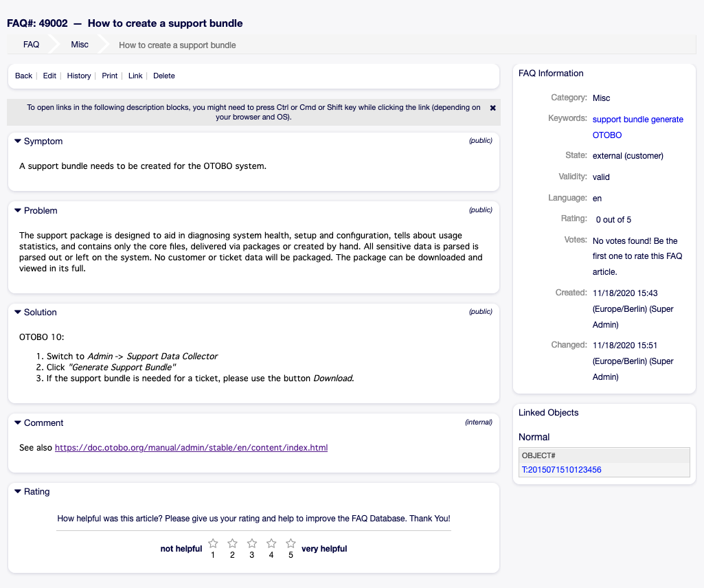
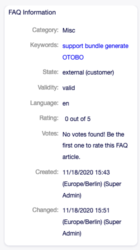
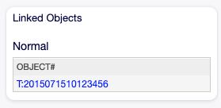

FAQ Zoom
========

Use this screen to see the details of an FAQ article. The *FAQ Zoom* screen is available, if you click on an FAQ article in any other screens.

   FAQ Zoom Screen

This screen has an own menu and contains several widgets.

FAQ Content
-----------

The *FAQ Zoom* screen has an own menu.

Back
   This menu item goes back to the previous screen.

Edit
   This menu item opens a new window to edit the FAQ article.

   .. figure:: images/faq-zoom-edit.png
      :alt: Edit FAQ Screen

      Edit FAQ Screen

History
   This menu item opens a new window to see the history of the FAQ article.

   .. figure:: images/faq-zoom-history.png
      :alt: FAQ History Screen

      FAQ History Screen

Print
   This menu item opens a PDF file to show the printer friendly version of the screen. You can save or print this PDF file.

Link
   This menu item opens the standard link screen of OTOBO. FAQ articles can be linked to other FAQ articles or tickets. Existing links can also be managed here.

   .. figure:: images/faq-zoom-link.png
      :alt: Link FAQ Screen

      Link FAQ Screen

Delete
   Use this menu item to delete the FAQ article.

   .. figure:: images/faq-zoom-delete.png
      :alt: Delete FAQ Dialog

      Delete FAQ Dialog

The *Symptom*, *Problem*, *Solution* and *Comment* widgets show the content of the FAQ article.

It is possible to rate an FAQ article in the *Rating* widget, whether the FAQ article is helpful or not. To rate an FAQ article, click on the *Yes* or *No* button in this widget.

Any user can rate an FAQ article only once. The number of positive and negative ratings will be displayed in the right sidebar.

FAQ Sidebar Widgets
-------------------

The following widgets are located on the right sidebar.

The *FAQ information* widget lists all relevant attributes of the FAQ article.

   FAQ Information Widget

FAQ articles can be linked to other objects. Use this widget to see the links between the FAQ article and other objects.

   Linked Objects Widget

New links can be added by the *Link* menu item of the *FAQ Zoom* menu. Existing links can also be managed there.

To see the linked object details, click on an entry in this widget.

.. seealso::

   Change setting ``LinkObject::ViewMode`` to *Complex* to display detailed information about linked objects.

   .. figure:: images/faq-zoom-linked-objects-complex.png
      :alt: Complex Linked Objects Widget

      Complex Linked Objects Widget
