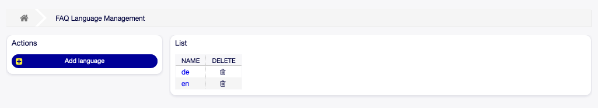
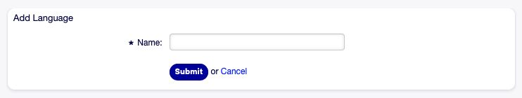
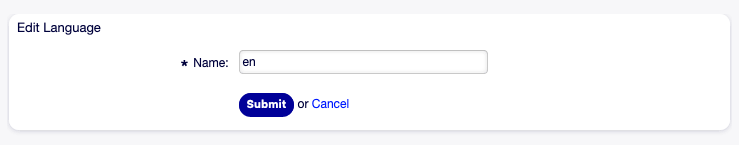
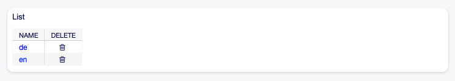

Language Management
===================

.. note::

   This menu item is only available for agents who have administrator privileges.

Use this screen to manage languages available in FAQ articles. A fresh OTOBO installation already contains some languages by default. The language management screen is available in the *Language Management* menu item of the *FAQ* menu.

   FAQ Language Management Screen

Manage FAQ Languages
--------------------

To add a language:

1. Click on the *Add language* button in the left sidebar.
2. Fill in the required field.
3. Click on the *Submit* button.

   Add Language Screen

To edit a language:

1. Click on a language in the list of languages.
2. Modify the field.
3. Click on the *Submit* button.

   Edit Language Screen

To delete a language:

1. Click on the trash icon in the list of languages.
2. Click on the *Yes* button in the confirmation dialog.

   Delete Language Screen

FAQ Language Settings
---------------------

The following setting is available when adding or editing this resource. The fields marked with an asterisk are mandatory.

Name \*
   The `ISO 639-1 code <https://en.wikipedia.org/wiki/List_of_ISO_639-1_codes>`__ of a language.
