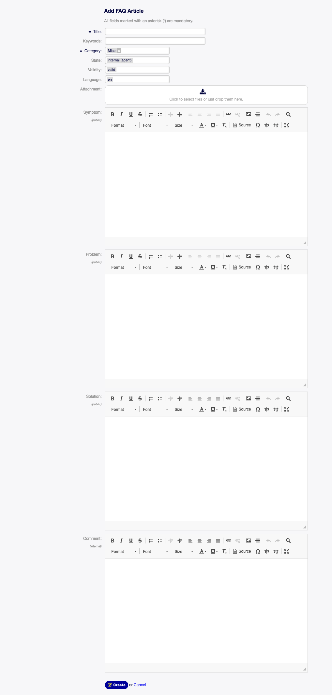

New
===

Use this screen to add new FAQ articles to the system. The FAQ add screen is available in the *New* menu item of the *FAQ* menu.

   Add FAQ Article Screen

The following settings are available when adding this resource. The fields marked with an asterisk are mandatory.

Title \*
   The name of this resource. Any type of characters can be entered to this field including uppercase letters and spaces. The name will be displayed in the overview table.

Keyword
   Add some keywords to make it easily to find the FAQ article.

Category \*
   Select a category from the available categories.

   .. seealso::

      Categories can be managed on the :doc:`category-management` screen.

State
   Select the state of the FAQ article. Possible options are:

   external (customer)
      FAQ article is visible for agents and logged in customer users on the external interface.

   internal (agent)
      FAQ article is visible for agents only.

   public (all)
      FAQ article is visible for everyone.

Validity
   Set the validity of this resource. Each resource can be used in OTOBO only, if this field is set to *valid*. Setting this field to *invalid* or *invalid-temporarily* will disable the use of the resource.

Language
   Select a language from the available languages.

   .. seealso::

      Languages can be managed on the :doc:`language-management` screen.

Attachment
   It is possible to add attachments to the FAQ article. Click on the field to add an attachment, or just drop some files here.

Symptom
   Add a description here, that explains the current situation.

Problem
   More detailed description about the problem.

Solution
   How to solve the problem, or what is a workaround to solve it.

Comment
   Internal text about the current FAQ article for agents only.
