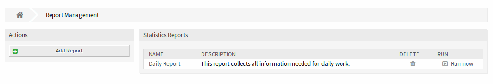
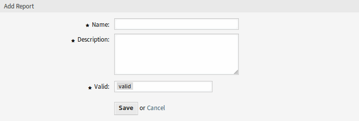
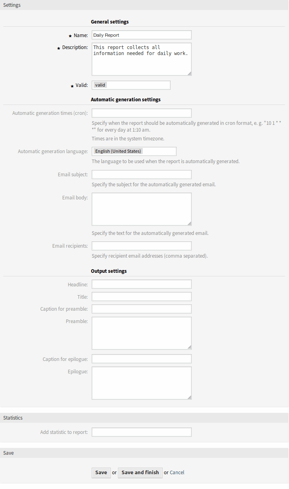
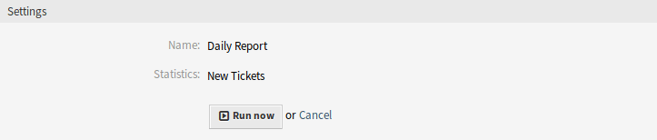

Reports
=======

Use this screen to manage reports. A fresh OTOBO installation contains no reports by default. The reports management screen is available in the *Reports* menu item of the *Reports* menu.

   Reports Overview Screen

Manage Reports
--------------

To create a new report:

1. Click on the *Add Report* button in the left sidebar.
2. Fill in the required fields.
3. Click on the *Save* button.
4. You will be redirected to *Edit Report* screen to edit the report details.

   Add Report Screen

To edit a report:

1. Click on a report in the list of reports or you are already redirected here from *Add Report* screen.
2. Modify the fields and the report details.
3. Click on the *Save* or *Save and finish* button.

   Edit Report Details Screen

To delete a report:

1. Click on the trash icon in the list of reports.
2. Click on the *OK* button in the confirmation screen.

To run a report immediately:

1. Click on the *Run now* link in the list of reports.
2. Click on the *Run now* button in the new screen.

   View Report Screen

General Report Settings
-----------------------

The following settings are available when adding or editing this resource. The fields marked with an asterisk are mandatory.

Name \*
   The name of this resource. Any type of characters can be entered to this field including uppercase letters and spaces. The name will be displayed in the overview table.

Description
   Add additional information to this resource. It is recommended to always fill this field as a description of the resource with a full sentence for better clarity, because the comment will be also displayed in the overview table.

Validity \*
   Set the validity of this resource. Each resource can be used in OTOBO only, if this field is set to *valid*. Setting this field to *invalid* or *invalid-temporarily* will disable the use of the resource.

Automatic Generation Settings
-----------------------------

Automatic generation times (cron)
   Specify when the report should be automatically generated in cron format.

   .. seealso::

      For more information see the `Cron article on Wikipedia <https://en.wikipedia.org/wiki/Cron>`__.

   .. note::

      Times are in the system timezone.

Automatic generation language
   The language to be used when the report is automatically generated.

Email subject
   Specify the subject for the automatically generated email.

Email body
   Specify the text for the automatically generated email.

Email recipients
   Specify recipient email addresses (comma separated).

Output settings
---------------

Headline
   This text will be used as headline text of the report.

Title
   The title of the report.

Caption for preamble
   The caption for preamble included in the report.

Preamble
   The preamble text of the report.

Caption for epilogue
   The caption for epilogue included in the report.

Epilogue
   The epilogue text of the report.

Statistics
----------

Add statistic to report
   Select one or more :doc:`statistics` to be added to the report. Each added statistics have an own overview and settings screen.

After all information is collected and set, click on the *Save* or *Save and finish* button to save the report.
