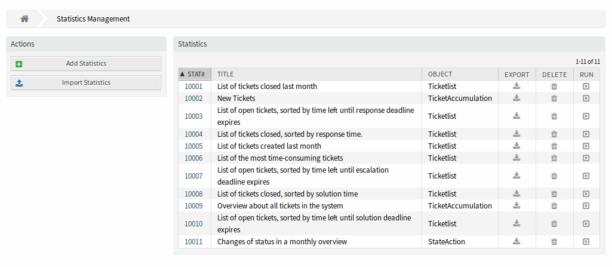
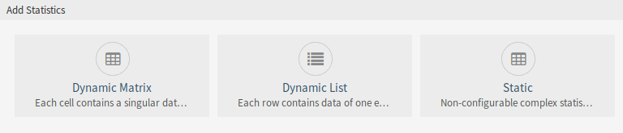
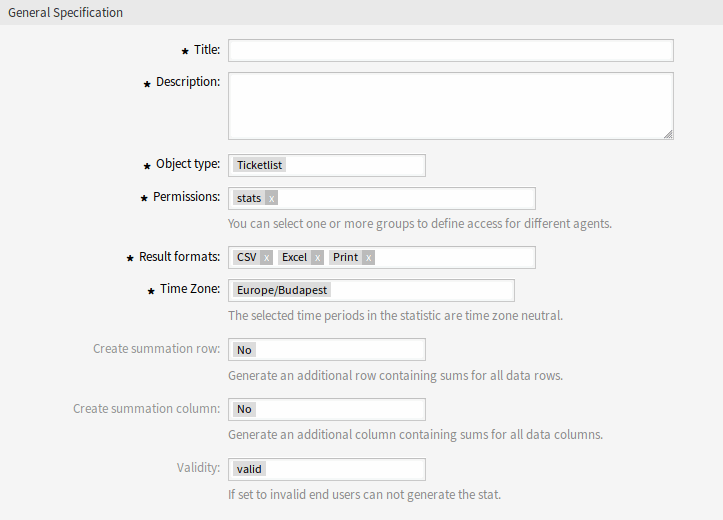
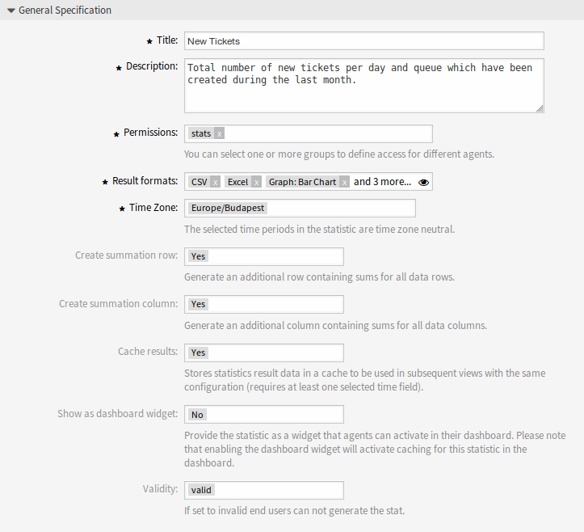
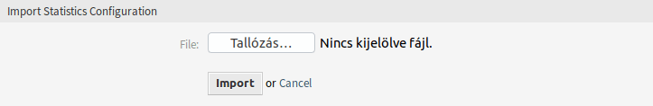
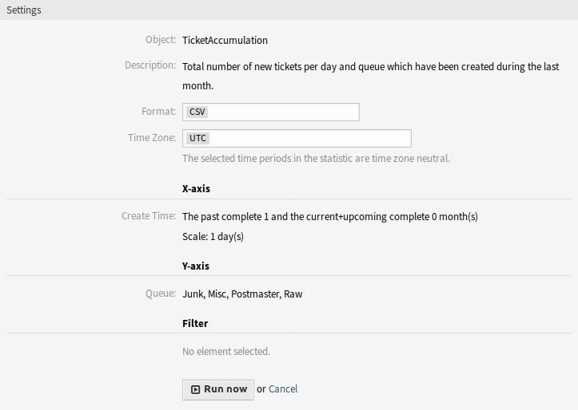
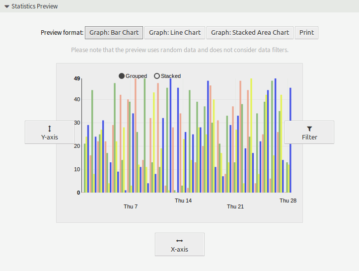

Statistics
==========

Use this screen to manage statistics. A fresh OTOBO installation already contains some statistics by default. The statistics management screen is available in the *Statistics* menu item of the *Reports* menu.

   Statistics Overview Screen

Manage Statistics
-----------------

Three type of statistics are available in OTOBO.

   Add Statistics Screen

Dynamic Matrix
   Each cell contains a singular data point.

Dynamic List
   Each row contains data of one entity.

Static
   Non-configurable complex statistics.

To create new statistics:

1. Click on the *Add Statistics* button in the left sidebar.
2. Select the type for the new statistics.
3. Fill in the required fields.
4. Click on the *Save* button.

   Add General Specification Section

To edit statistics:

1. Click on a statistics number in the list of statistics.
2. Modify the fields and the statistics details.
3. Click on the *Save* or *Save and finish* button.

   Edit General Specification Section

To import statistics:

1. Click on the *Import Statistics* button in the left sidebar.
2. Click on the *Browse…* button and select a previously exported ``.xml`` file.
3. Click on the *Import* button.
4. Modify the fields and the statistics details.
5. Click on the *Save* or *Save and finish* button.

   Import Statistics Configuration Screen

To export statistics:

1. Click on the download icon in the list of statistics.
2. Choose a location in your computer to save the ``.xml`` file.

To delete statistics:

1. Click on the trash icon in the list of statistics.
2. Click on the *OK* button in the confirmation screen.

To run statistics:

1. Click on the play icon in the list of statistics.
2. Review the statistics details.
3. Click on the *Run now* button.

   View Statistics Screen

To preview statistics:

1. Go the the edit screen of a statistics.
2. See the preview.
3. Change the settings to view different type of graphs.
4. Change the values of *X-axis*, *Y-axis* and *Filter* with the respective buttons.

   Statistics Preview Widget

.. note::

   The preview uses random data and does not consider data filters.

General Statistics Specification
--------------------------------

The following settings are available when adding or editing this resource. The fields marked with an asterisk are mandatory.

Title \*
   The name of this resource. Any type of characters can be entered to this field including uppercase letters and spaces. The name will be displayed in the overview table.

Description
   Add additional information to this resource. It is recommended to always fill this field as a description of the resource with a full sentence for better clarity, because the comment will be also displayed in the overview table.

Permissions \*
   You can select one or more groups to define access for different agents.

Result formats \*
   You can select, in which format should be able to see the statistics.

Time Zone \*
   The selected time periods in the statistics are time zone neutral.

Create summation row
   Generate an additional row containing sums for all data rows.

Create summation column
   Generate an additional column containing sums for all data columns.

Cache results
   Stores statistics result data in a cache to be used in subsequent views with the same configuration (requires at least one selected time field).

Show as dashboard widget
   Provide the statistics as a widget that agents can activate in their dashboard.

   .. note::

      Enabling the dashboard widget will activate caching for this statistics in the dashboard.

Validity \*
   Set the validity of this resource. Each resource can be used in OTOBO only, if this field is set to *valid*. Setting this field to *invalid* will disable the use of the resource.

Ticket Attributes for Statistics
--------------------------------

The following ticket attributes can be included in statistics using the *X-axis* button, if *Dynamic Lists* statistics are selected.

Number
   An auto-increment integer number in the output to show the line numbers.

Ticket#
   The ticket number.

Age
   The relative age since ticket creation and now.

Title
   The title of the ticket.

Created
   The absolute date and time with timezone when the ticket was created.

Last Changed
   The absolute date and time with timezone when the ticket was changed.

Close Time
   The absolute date and time with timezone when the ticket was closed. This field is empty for open tickets.

Queue
   The queue in which the ticket is located.

State
   The state of the ticket.

Priority
   The priority of the ticket.

Customer User
   The login name of the customer user of the ticket.

Customer ID
   The customer of the customer user of the ticket.

Service
   The service of the ticket. If no service is assigned, this field is empty.

SLA
   The SLA of the ticket. If no SLA is assigned, this field is empty.

Type
   The type of the ticket.

Agent/Owner
   The owner agent of the ticket.

Responsible
   The responsible agent of the ticket.

Accounted time
   Accumulated time of the times stored in the articles.

EscalationDestinationIn
   The relative time from the current time to the time of escalation.

EscalationDestinationDate
   The absolute date and time with timezone when the ticket is escalated.

EscalationTimeWorkingTime
   The time in seconds within the defined working time or service time until an escalation.

EscalationTime
   The total time in seconds until escalation of nearest escalation time type: response, update or solution time.

FirstResponse
   The timestamp of first response.

FirstResponseInMin
   The time in minutes from ticket creation to first response (based on working time).

FirstResponseDiffInMin
   The difference in minutes between the specified response time and the actual response time.

FirstResponseTimeWorkingTime
   The time in seconds within the defined working time or service time until an escalation of a first response.

FirstResponseTimeEscalation
   Defines, whether the ticket has escalated or not.

FirstResponseTimeNotification
   Defines, whether the defined escalation notification time is reached or not.

FirstResponseTimeDestinationTime
   The escalation time as Unix timestamp.

FirstResponseTimeDestinationDate
   The absolute date of a first response time escalation.

FirstResponseTime
   The total time in seconds until the first response time escalation.

UpdateTimeNotification
   Defines, whether the defined escalation notification time is reached or not.

UpdateTimeDestinationTime
   The update time escalation as Unix timestamp.

UpdateTimeDestinationDate
   The absolute date of an update time escalation.

UpdateTimeWorkingTime
   The time in seconds within the defined working time or service time until an update time escalation.

UpdateTime
   The total time in seconds until an update time escalation.

SolutionTime
   The total time in seconds until a solution time escalation.

SolutionInMin
   The total time in minutes until a solution time escalation.

SolutionDiffInMin
   The difference in minutes between the specified solution time and the actual solution time.

SolutionTimeWorkingTime
   The time in seconds within the defined working time or service time until a solution time escalation.

SolutionTimeEscalation
   Defines, whether the ticket has escalated or not.

SolutionTimeNotification
   Defines, whether the defined escalation notification time is reached or not.

SolutionTimeDestinationTime
   The solution time escalation as Unix timestamp.

SolutionTimeDestinationDate
   The absolute date of a solution time escalation.

First Lock
   The absolute date and time with timezone when the ticket was locked first. This field is empty for tickets, that are not locked yet.

Lock
   The lock state of the ticket.

StateType
   State type of the ticket.

UntilTime
   Total seconds till pending.

UnlockTimeout
   Time until the ticket is automatically unlocked.

EscalationResponseTime
   Unix timestamp of response time escalation.

EscalationSolutionTime
   Unix timestamp of solution time escalation.

EscalationUpdateTime
   Unix timestamp of update time escalation.

RealTillTimeNotUsed
   Unix timestamp of pending time.

Number of Articles
   The number of articles in the ticket.

Process
   The name of the process in which a process ticket is involved.

Activity
   The name of the activity in the process.

Activity Status
   The status of the activity in the process.

DynamicField_NameX
   The name of the dynamic fields added to the system. The list of dynamic fields is different in each system.
