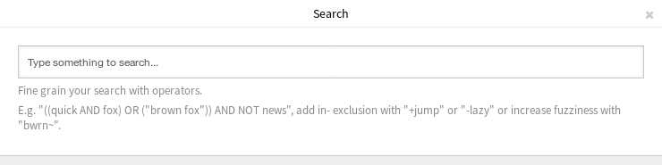
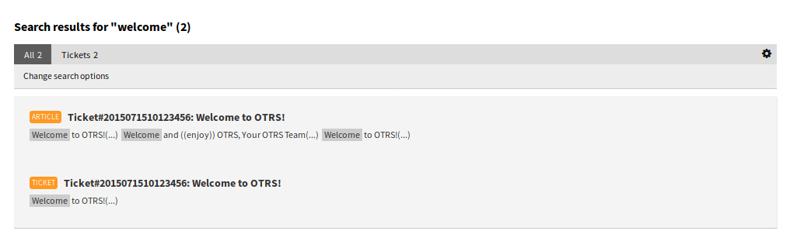

Search
======

Use this menu item to search for something. The *Search Results* screen is available, if you click on the magnification glass icon in the main menu, enter a search term and hit *Enter* key on your keyboard.

   Search Dialog

If the search has results, a new screen will open.

   Search Results Screen

This screen lists all objects that matches the search term. The objects are grouped by type.

To find the desired object:

1. Select a type in the header of the widget.
2. Use the filter in the right sidebar to narrow the result.

There is an option *All* to see all type of object.

Search Parameters
-----------------

The query string consists of *terms* and *operators*. A term can be a single word or a phrase surrounded by double quotes. Operators allow you to customize the search.

Single word
   If the query string is a single word (for example ``quick`` or ``brown``), then OTOBO searches for all items containing the given word.

   If two or more words are given in the query string (for example ``quick brown``), then OTOBO searches for all items containing the word ``quick`` **or** ``brown``.

Phrase surrounded by double quotes
   If the query string contains a phrase surrounded by double quotes (for example ``"quick brown"``), then OTOBO searches for all items containing the words in the phrase in the same order.

Wildcards
   Use ``?`` to replace a single character, and ``*`` to replace zero or more characters (for example ``qu?ck bro*``).

   .. note::

      Wildcard queries can lead to performance issues, because many terms need to be queried to match the query string.

Regular expressions
   Regular expression patterns can be embedded in the query string by wrapping them in slashes (for example ``/joh?n(ath[oa]n)/``).

   .. seealso::

      The supported regular expression syntax is explained in `Regular expression syntax <https://www.elastic.co/guide/en/elasticsearch/reference/current/query-dsl-regexp-query.html#regexp-syntax>`__ chapter of the Elasticsearch documentation.

Fuzziness
   It is possible to search for terms that are similar to, but not exactly like the given search terms, using the *fuzzy* operator (for example ``quikc~ brwn~ foks~``).

   The default fuzziness level is 2, but a level of 1 should be sufficient to catch 80% of all human misspellings. It can be specified as ``quikc~1``.

   Fuzziness can be disabled with ``quikc~0`` which will not consider spelling mistakes.

Proximity
   A query string like ``"quick fox"`` searches the words in exactly the same order, but the proximity search allows that some other words can be included between the given words (for example ``"fox quick"~5``).

   This operator specifies the maximum edit distance of words. The phrase *quick fox* would be considered more relevant than *quick brown fox*.

Ranges
   The query string can contain ranges for date, numeric or string fields. Inclusive ranges are specified with square brackets ``[min TO max]`` and exclusive ranges with curly brackets ``{min TO max}``.

Boosting
   The *boost* operator ``^`` can be used to make one term more relevant than another. For example use the query string ``quick^2 fox``, if you want to find all documents about foxes, but you are especially interested in quick foxes.

   You can also use boosts for phrases or groups, for example ``"quick fox"^2 AND (brown lazy)^4``.

Boolean operators
   The query string ``quick brown fox`` searches for all items containing one or more of the specified words.

   The preferred operators are ``+`` (term must be present) and ``-`` (term must not be present). All other terms are optional.

   For example if the query string is ``quick brown +fox -news`` then it means:

   - ``fox`` must be present.
   - ``news`` must not be present.
   - ``quick`` and ``brown`` are optional.

   The well known logical operators ``AND``, ``OR`` and ``NOT`` (or ``&&``, ``||`` and ``!``) are also supported. The query string ``((quick AND fox) OR (brown AND fox) OR fox) AND NOT news`` is identical with the previous example.

Grouping
   Changing the precedence with parentheses is possible, like ``(quick OR brown) AND fox``.

Reserved characters
   There are some reserved characters which function as operators, and they can not be used in search queries.

   The reserved characters are: ``+ - = && || > < ! ( ) { } [ ] ^ " ~ * ? : \ /``.

   If any of these characters need to be used in search queries, then you should escape them with a leading backslash. For example to search for the term *(1+1)=2*, you have to use the query string as ``\(1\+1\)\=2``.

.. seealso::

   More information can be found in the `Query string syntax <https://www.elastic.co/guide/en/elasticsearch/reference/current/query-dsl-query-string-query.html#query-string-syntax>`__ chapter of the Elasticsearch documentation.
