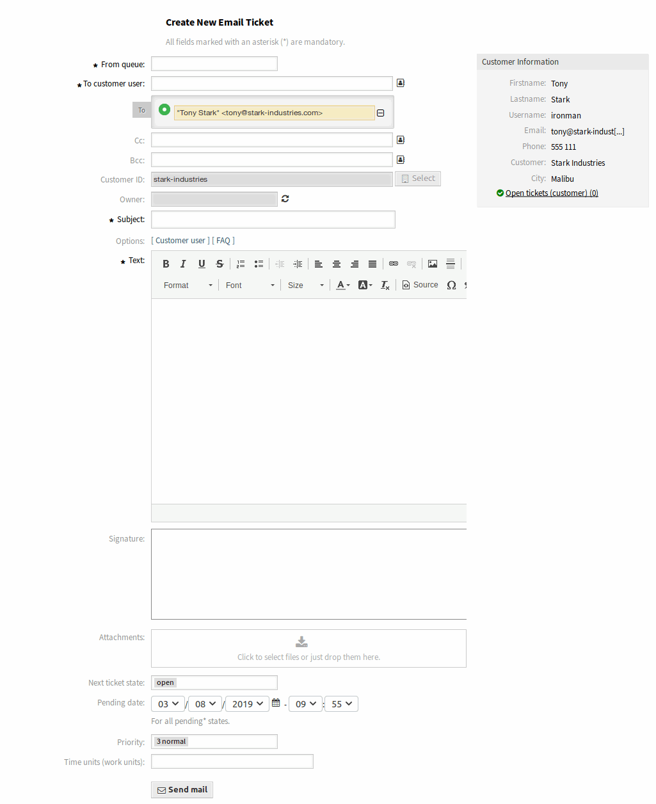

New Email Ticket
================

Use this screen to create tickets and send them to customer users. The email ticket screen is available in the *New Email Ticket* menu item of the *Tickets* menu.

   New Email Ticket Screen

The following settings are available when adding this resource. The fields marked with an asterisk are mandatory.

From queue \*
   Select a queue, where the new ticket should be placed to. The queue address will be the *From* field of the email.

To customer user \*
   The person, to whom the ticket is created for. This will be the *To* field of the email.

   .. note::

      Usage of wildcards (\*) is also possible. Enter two asterisks (\*\*) to list all customer users.

Cc
   Select other customer users as carbon copy of the email, if needed.

Bcc
   Select other customer users as blind carbon copy of the email, if needed.

Customer ID
   This field will be auto-populated by selecting a customer user.

To queue \*
   The queue, where the new ticket will be placed to.

Owner
   The owner is an agent, who actually works with the new ticket.

   .. seealso::

      Enable ``Ticket::Responsible`` setting to set an other agent as responsible for the ticket.

Subject \*
   The subject of the ticket like the subject of an email.

This might be helpful
   This field is not visible by default, but it displays related :doc:`../faq` articles based on the keywords entered in the *Subject* and/or the *Text* fields. Clicking on a FAQ article opens the :doc:`../faq/faq-zoom` screen.

   The related FAQ articles are displayed as the agent types, so the list of suggested FAQ articles is updated after any word typed into the *Subject* and/or the *Text* fields. The suggested FAQ articles are sorted based on the number of matched keywords.

Options
   It is possible to add other objects like customer users or FAQ articles to the ticket.

Text \*
   The body text of the first article of the ticket.

Signature
   The signature assigned to the selected queue. Please contact your administrator to change the signature.

Attachments
   It is possible to add attachments to the ticket. Click on the field to add an attachment, or just drop some files here.

Next ticket state
   New tickets are in *open* state by default. Select an other state if you want to change it.

Pending date
   Select a date and time as reminder for the ticket. If the pending time is reached, the ticket can be escalated.

Priority
   New tickets have *3 normal* priority by default. Select an other priority if you want to change it.

Time units (work units)
   Enter any amount of time units for time accounting.

After all information is collected and set, click on the *Send mail* button to create the new ticket and send the email to the selected customer users.
