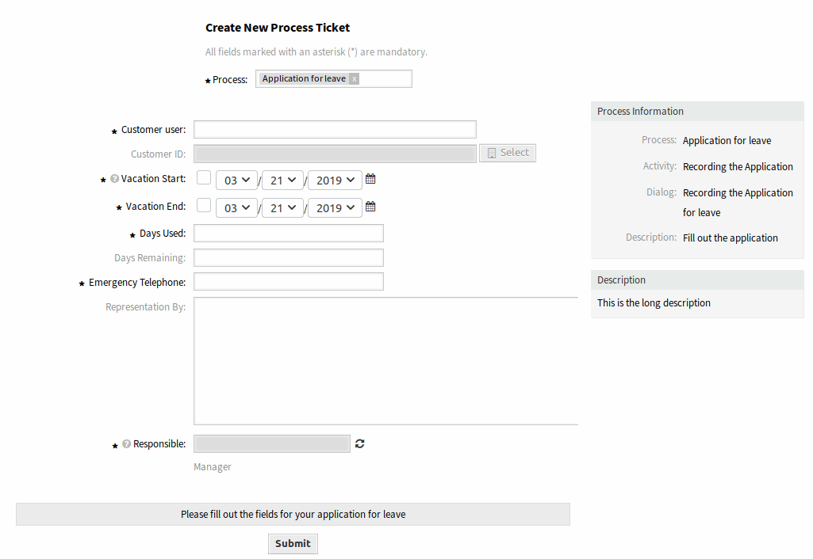

New Process Ticket
==================

.. note::

   This option is available only, if at least one process is deployed in the system.

Use this screen to create tickets from processes. The process ticket screen is available in the *New Process Ticket* menu item of the *Tickets* menu.

   New Process Ticket Screen

The following setting is available when adding this resource. The fields marked with an asterisk are mandatory.

Process \*
   A process needs to be selected from the list to continue.

   .. seealso::

      Processes can be defined in the *Process Management* module of the administrator interface.

After a process is selected, the screen will be refreshed with the first activity dialog of the selected process.

   Application For Leave Process Activity Dialog

.. note::

   The fields displayed here are depend on the process, therefore no explanation is described here for those fields.
