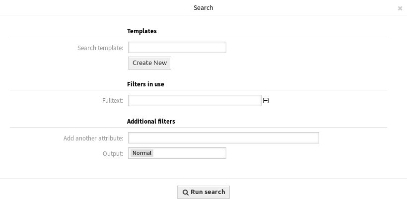
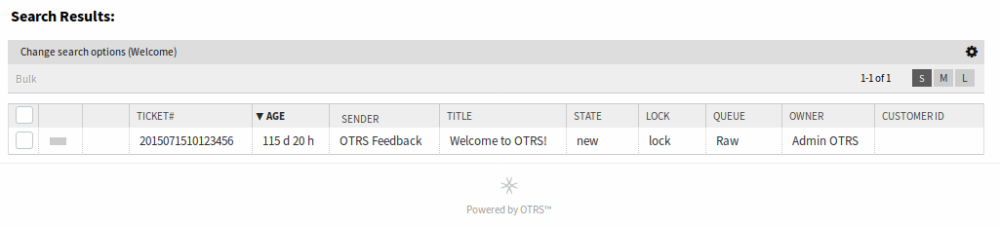

Search
======

Use this screen to search for tickets based on various criteria. The ticket search screen is available in the *Search* menu item of the *Tickets* menu.

   Search Dialog

The dialog is divided into three parts: *Templates*, *Filters in use* and *Additional filters*.

Templates
---------

This part of the dialog can be used to save a search template for further usage.

To create a new search template:

1. Click on the *Create New* button.
2. Enter a name for the search template.
3. Add some search criteria.
4. Click on the *Run Search* button.

To use a saved search template:

1. Select a template from the drop-down list.
2. Click on the *Run Search* button.

.. figure:: images/tickets-search-templates.png
   :alt: Search Templates Dialog

   Search Templates Dialog

If only one ticket matches, the :doc:`ticket-zoom` will be opened. Otherwise you will be redirected to *Search Results* screen to see all matched tickets.

To delete a saved search template:

1. Click on the *Delete* button.

.. warning::

   The template will be deleted immediately without confirmation!

Use the *Profile link* button to go directly to *Search Results* screen. This is the permanent link of the search template.

   Search Results Screen

Filters in use
--------------

This part lists the filters, that are used for the search.

Additional filters can be added in the *Additional filters* part of the screen, and filters can be removed by clicking on the *⊟* button next to the field.

Additional filters
------------------

This part is for adding more filters and selecting the output format of the results.

Add another attribute
   Select an extra attribute from the drop-down list to be used in the search.

Output
   Select the output format of the result.

You can start the search by clicking on the *Run search* button.
