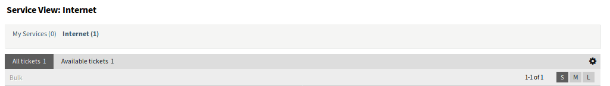
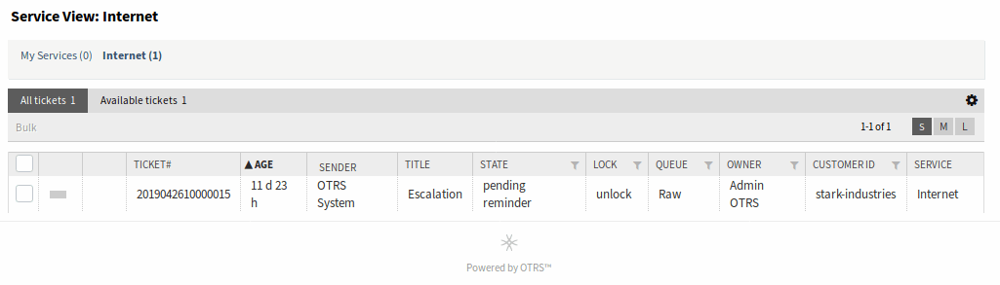
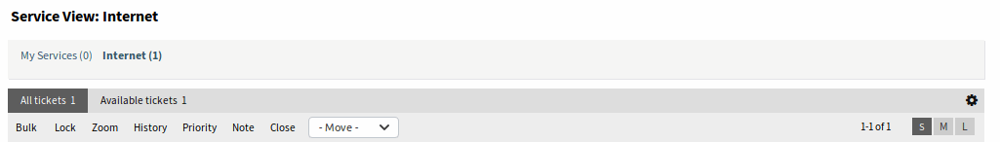
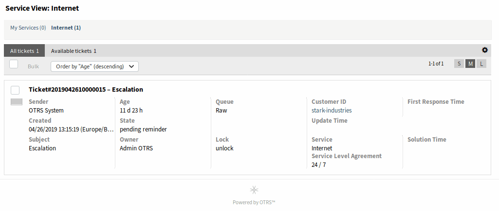
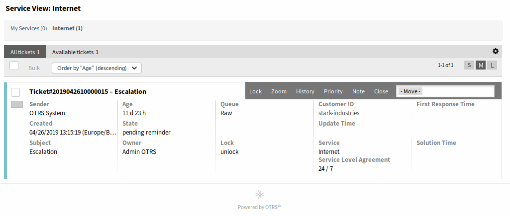
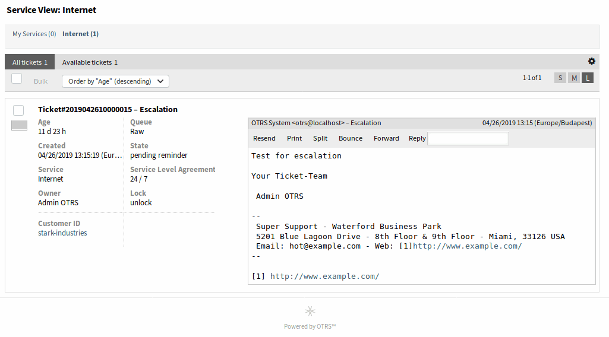
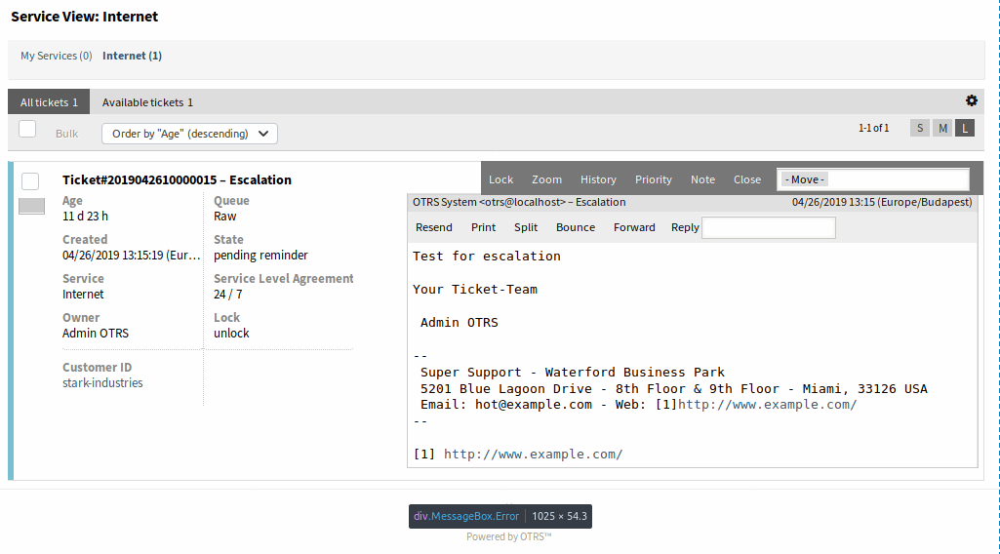

Service View
============

.. seealso::

   System configuration ``Ticket::Service`` needs to be activated to use this feature.

Use this screen to view tickets in specific services. The *Service View* screen is available in the *Service View* menu item of the *Tickets* menu.

This screen has three different views: small, medium and large. You can change the views with the buttons in the right side of the widget: *S* means *small*, *M* means *medium* and *L* means *large*.

   Service View Widget Header

Each view has a filter in the top of the widget to list tickets only in a specific service or tickets in *My Services* set in :doc:`../avatar/personal-preferences`.

There are also filters to view *All tickets* or only *Available tickets*.

All tickets
   This option lists all tickets in the selected queue.

Available tickets
   This option lists only open tickets which are available for working with them.

Small Service View
------------------

This view lists tickets in a table format.

   Small Service View Screen

To limit the number of displayed tickets per page:

1. Click on the gear icon in the top right corner of the overview header.
2. Select the maximum number of tickets displayed per page.
3. Click on the *Save* button.

To set the displayed columns and adjust order of columns:

1. Click on the gear icon in the top right corner of the overview header.
2. Move columns from *Available Columns* to *Visible Columns* or vice versa.
3. Rearrange columns in *Visible Columns* by drag and drop.
4. Click on the *Save* button.

.. note::

   Use the filter box to find a particular column in *Available Columns* by just typing the name to filter.

To sort tickets by a specific attribute:

1. Click on a column header to sort tickets by the selected attribute.
2. Click on the column header again to change the sort order.

It is possible to filter tickets by a specific attribute, but not all attributes can be used as filter. The filterable attributes are marked with a filter icon in the column header.

To filter tickets:

1. Click on the filter icon in the column header.
2. Select a value for the filter.

.. note::

   Multiple filters can be set. Active filters are marked with a bold filter icon in the column header and a trash icon is displayed in the widget header. Click on this trash icon to remove all active filters.

This view has an own menu to manage tickets. Select a checkbox in the row of a ticket to see this menu.

Bulk
   Bulk action for the ticket, multiple attributes can be changed (see below).

Zoom
   Open the :doc:`ticket-zoom` screen to see all details of the ticket.

History
   A new window will be opened that displays the history of the ticket.

Note
   New note can be added to the ticket.

Move
   The ticket can be moved to an other queue.

Medium Service View
-------------------

This view lists tickets in a list view format.

   Medium Service View Screen

To limit the number of displayed tickets per page:

1. Click on the gear icon in the top right corner of the overview header.
2. Select the maximum number of tickets displayed per page.
3. Click on the *Save* button.

Hover the mouse over the ticket row, and a floating menu will appear. The floating menu has the same menu items that are already explained in the *Small Service View* section.

   Floating Menu of Medium Service View

Large Service View
------------------

This view lists tickets in a detailed format.

   Large Service View Screen

To limit the number of displayed tickets per page:

1. Click on the gear icon in the top right corner of the overview header.
2. Select the maximum number of tickets displayed per page.
3. Click on the *Save* button.

Hover the mouse over the ticket row, and a floating menu will appear. The floating menu has the same menu items that are already explained in the *Small Service View* section.

   Floating Menu of Large Service View

Service View Bulk Actions
-------------------------

Multiple attributes can be changed in this screen at the same time.

.. figure:: images/all-views-small-bulk.png
   :alt: Service View Bulk Action Screen

   Service View Bulk Action Screen
