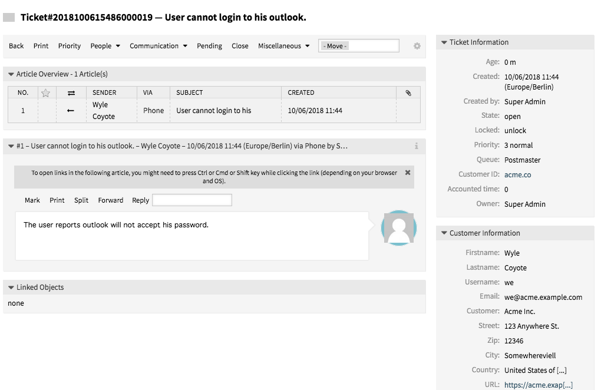
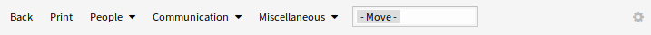
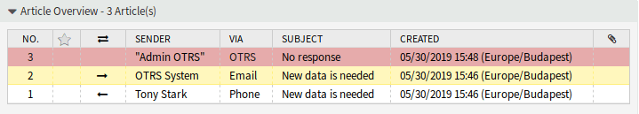
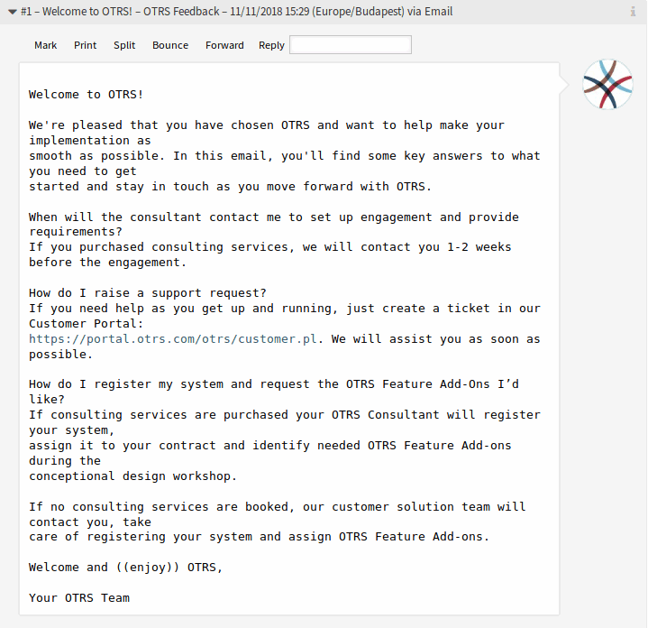
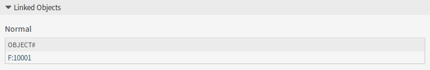
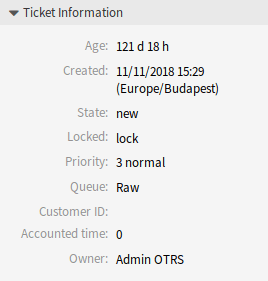
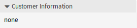

Ticket Zoom
===========

Use this screen to see the details of a ticket. The *Ticket Zoom* screen is available, if you click on a ticket in any other screens.

   Ticket Zoom Screen

This screen has an own menu and contains several widgets.

Ticket Menu
-----------

The *Ticket Zoom* screen has an own menu.

The menu is extensible and menu items can be grouped into drop-down lists.

   Ticket Menu

Back
   This menu item goes back to the previous screen.

Lock or Unlock
   The name of the menu item depends on the lock state of the ticket.

   Lock
      If the ticket is unlocked, an agent can lock the ticket and the agent becomes the ticket owner.

   Unlock
      If the ticket is locked to an agent, the agent can release the ticket and other agents can lock it.

      .. warning::

         This menu item has no confirmation window. Lock or unlock the ticket is done immediately.

Print
   This menu item opens a PDF file to show the printer friendly version of the screen. You can save or print this PDF file.

Priority
   This menu item opens a new window to change the priority of the ticket.

   .. figure:: images/ticket-zoom-priority.png
      :alt: Change Priority Screen

      Change Priority Screen

   Priority
      Select the new priority for the ticket.

   Subject \*
      The subject of the ticket like the subject of an email.

   Options
      It is possible to add other objects like customer users or FAQ articles to the ticket.

   Text \*
      The body text of the note to be added to the ticket.

   Attachments
      It is possible to add attachments to the ticket. Click on the field to add an attachment, or just drop some files here.

   Is visible for customer
      Define, if the note is an internal note or customer can view it.

   Time units (work units)
      Enter any amount of time units for time accounting.

People
   This menu item groups the following menu items together:

   Owner
      This menu item opens a new window to change the owner of the ticket.

      .. figure:: images/ticket-zoom-owner.png
         :alt: Change Owner Screen

         Change Owner Screen

      New Owner \*
         Select the new owner agent from the list. The agent needs *owner* permission, otherwise the agent is not listed.

      Subject \*
         The subject of the ticket like the subject of an email.

      Options
         It is possible to add other objects like customer users or FAQ articles to the ticket.

      Text \*
         The body text of the note to be added to the ticket.

      Attachments
         It is possible to add attachments to the ticket. Click on the field to add an attachment, or just drop some files here.

      Is visible for customer
         Define, if the note is an internal note or customer can view it.

      Time units (work units)
         Enter any amount of time units for time accounting.

   Customer
      This menu item opens a new window to change the customer of the ticket.

      .. figure:: images/ticket-zoom-customer.png
         :alt: Change Customer Screen

         Change Customer Screen

      Customer user \*
         The new customer user of the ticket.

      Customer ID
         Automatically selected based on the customer user.

Communication
   This menu item groups the following menu items together:

   Note
      This menu item opens a new window to add a note as new article to the ticket.

      .. figure:: images/ticket-zoom-note.png
         :alt: Add Note Screen

         Add Note Screen

      Subject \*
         The subject of the ticket like the subject of an email.

      Options
         It is possible to add other objects like customer users or FAQ articles to the ticket.

      Text \*
         The body text of the note to be added to the ticket.

      Attachments
         It is possible to add attachments to the ticket. Click on the field to add an attachment, or just drop some files here.

      Is visible for customer
         Define, if the note is an internal note or customer can view it.

      Time units (work units)
         Enter any amount of time units for time accounting.

   Phone Call Outbound
      This menu item opens a new window to add a note based on an outgoing phone call to the ticket.

      .. figure:: images/ticket-zoom-phone-call.png
         :alt: Phone Call Screen

         Phone Call Screen

      Subject \*
         The subject of the ticket like the subject of an email.

      Options
         It is possible to add other objects like customer users or FAQ articles to the ticket.

      Text \*
         The body text of the note to be added to the ticket.

      Attachments
         It is possible to add attachments to the ticket. Click on the field to add an attachment, or just drop some files here.

      Next ticket state
         Select an other state if you want to change it.

      Pending date
         Select a date and time as reminder for the ticket. If the pending time is reached, the ticket can be escalated.

      Time units (work units)
         Enter any amount of time units for time accounting.

   Phone Call Inbound
      This menu item opens a new window to add a note based on an incoming phone call to the ticket.

      This screen is the same as *Phone Call Outbound* screen.

   E-Mail Outbound
      This menu item opens a new window to send an email and add the email as article to the ticket. This screen is very similar to an email client screen.

      .. figure:: images/ticket-zoom-email.png
         :alt: Outbound Email Screen

         Outbound Email Screen

      From
         This field is read only and holds the queue address.

      To \*
         This will be the *To* field of the email.

      Cc
         Select other customer users as carbon copy of the email, if needed.

      Bcc
         Select other customer users as blind carbon copy of the email, if needed.

      .. note::

         You can select a customer user from OTOBO or any valid email address can be added here.

         Usage of wildcards (\*) is also possible. Enter two asterisks (\*\*) to list all customer users.

      Subject \*
         The subject of the ticket like the subject of an email.

      Options
         It is possible to add other objects like customer users or FAQ articles to the ticket.

      Text \*
         The body text of the note to be added to the ticket.

      Attachments
         It is possible to add attachments to the ticket. Click on the field to add an attachment, or just drop some files here.

      Next ticket state
         Select an other state if you want to change it.

      Pending date
         Select a date and time as reminder for the ticket. If the pending time is reached, the ticket can be escalated.

      Visible for customer
         Define, if the note is an internal note or customer can view it.

      Time units (work units)
         Enter any amount of time units for time accounting.

Pending
   This menu item opens a new window to set the pending time of the ticket.

   .. figure:: images/ticket-zoom-pending.png
      :alt: Set Pending Time Screen

      Set Pending Time Screen

   Next state
      Select the pending state of the ticket.

   Pending date
      Select a date and time as reminder for the ticket. If the pending time is reached, the ticket can be escalated.

   Subject \*
      The subject of the ticket like the subject of an email.

   Options
      It is possible to add other objects like customer users or FAQ articles to the ticket.

   Text \*
      The body text of the note to be added to the ticket.

   Attachments
      It is possible to add attachments to the ticket. Click on the field to add an attachment, or just drop some files here.

   Is visible for customer
      Define, if the note is an internal note or customer can view it.

   Time units (work units)
      Enter any amount of time units for time accounting.

Close
   This menu item opens a new window to close the ticket.

   .. figure:: images/ticket-zoom-close.png
      :alt: Set Pending Time Screen

      Set Pending Time Screen

   Next state
      Select the closed state of the ticket.

   Subject \*
      The subject of the ticket like the subject of an email.

   Options
      It is possible to add other objects like customer users or FAQ articles to the ticket.

   Text \*
      The body text of the note to be added to the ticket.

   Attachments
      It is possible to add attachments to the ticket. Click on the field to add an attachment, or just drop some files here.

   Is visible for customer
      Define, if the note is an internal note or customer can view it.

   Time units (work units)
      Enter any amount of time units for time accounting.

Quick Close
   Close the ticket by one click.

Process
   This menu item opens the :doc:`new-process-ticket` screen to start a process from this ticket.

   .. note::

      This option is available only, if at least one process is deployed in the system.

Miscellaneous
   This menu item groups the following menu items together:

   History
      This menu item opens a new window to see the history of the ticket.

   .. figure:: images/ticket-zoom-history.png
      :alt: Ticket History Screen

      Ticket History Screen

   .. note::

      If several entries are added to the history, use the filter box to find a particular entry by just typing something to filter.

   Print
      This menu item opens a PDF file to show the printer friendly version of the screen. You can save or print this PDF file.

   Free Fields
      This menu item opens a new window to change the free field values of the ticket.

   .. figure:: images/ticket-zoom-free-fields.png
      :alt: Ticket Free Text Screen

      Ticket Free Text Screen

      Title \*
         The title of the ticket.

   Link
      This menu item opens the standard link screen of OTOBO. Tickets can be linked to other tickets, FAQ articles or appointments. Existing links can also be managed here.

      .. figure:: images/ticket-zoom-link.png
         :alt: Link Ticket Screen

         Link Ticket Screen

      Link with
         Select the other object the ticket should be linked to.

      The other fields can be used to find the appropriate object to link, and the fields can be different for each object.

   Merge
      This menu item opens a new window to find a destination ticket for the current ticket. The articles of current ticket will be moved to the destination ticket, and the current ticket will get the state *merged*.

      .. figure:: images/ticket-zoom-merge.png
         :alt: Ticket Merge Screen

         Ticket Merge Screen

      Merge to Ticket# \*
         Try typing part of the ticket number or title in order to search by it.

      Inform sender
         Check this box, if you would like to inform sender about ticket merge. If this box is checked, the following fields must be filled.

      From
         This field is read only and holds the queue address.

      To \*
         This will be the *To* field of the email.

      Subject \*
         The subject of the ticket like the subject of an email.

      Text \*
         The body text of the email to be sent.

   New Appointment
      This menu item opens the :doc:`../calendar/new-appointment` dialog, and selects the current ticket in the *Ticket* field for linking.

Move
   This menu item is only a drop-down list of available queues. Select a destination queue, if the ticket needs to be moved there.

   .. warning::

      This menu item has no confirmation window. Moving the ticket to an other queue is done immediately.

Settings
   Click on the gear icon in the right side of the ticket menu to change the article view settings. The following options are available:

   Show one article
      Only the article is displayed in the *Article Zoom* widget, which is selected in the *Article Overview* widget.

   Show all articles
      All articles are displayed in the *Article Zoom* widget under each other.

Article Overview
----------------

This widget lists all articles of the ticket in a table.

   Article Overview Widget

Most of the columns are sortable by clicking on the header. Click again to change the sort order.

There are three possible colors used to mark the type of article.

- White: the article is visible for the customer user in the external interface and for agents in the agent interface.
- Red: the article is not visible for the customer user in the external interface, but it is visible for agents in the agent interface.
- Yellow: the article is a system message and the visibility can be changed in the system configuration.

.. note::

   This widget is not displayed in ticket timeline view.

Article Zoom
------------

This widget displays the details of the article. The widget has an own menu.

   Article Zoom Widget

The menu is extensible and menu items can be grouped into drop-down lists.

Mark or Unmark
   Use this menu item to mark article as important or to remove the important flag from the article. Important articles have a red information flag in the *Article Overview* widget.

Print
   This menu item opens a PDF file to show the printer friendly version of the current article. You can save or print this PDF file.

Split
   Use this menu item to split the article to an other ticket. Select the new ticket type and click on the *Submit* button.

   .. figure:: images/ticket-zoom-article-split.png
      :alt: Article Split Dialog

      Article Split Dialog

   It is possible to split the article into several type of ticket.

   Email ticket
      Selecting this will open the :doc:`new-email-ticket` screen and fill in the fields with the current article data.

   Phone ticket
      Selecting this will open the :doc:`new-phone-ticket` screen and fill in the fields with the current article data.

   Process ticket
      Selecting this will open the :doc:`new-process-ticket` screen and fill in the fields with the current article data.

      .. note::

         This option is available only, if at least one process is deployed in the system.

Forward
   Use this menu item to forward the article via email.

   .. figure:: images/ticket-zoom-article-forward.png
      :alt: Article Forward Screen

      Article Forward Screen

   From
      This field is read only and holds the queue address.

   To \*
      This will be the *To* field of the email.

   Cc
      Select other customer users as carbon copy of the email, if needed.

   Bcc
      Select other customer users as blind carbon copy of the email, if needed.

   .. note::

      You can select a customer user from OTOBO or any valid email address can be added here.

      Usage of wildcards (\*) is also possible. Enter two asterisks (\*\*) to list all customer users.

   Subject \*
      The subject of the ticket like the subject of an email.

   Options
      It is possible to add other objects like customer users or FAQ articles to the ticket.

   Text \*
      The body text of the note to be added to the ticket.

   Attachments
      It is possible to add attachments to the ticket. Click on the field to add an attachment, or just drop some files here.

   Next ticket state
      Select an other state if you want to change it.

   Pending date
      Select a date and time as reminder for the ticket. If the pending time is reached, the ticket can be escalated.

   Visible for customer
      Define, if the note is an internal note or customer can view it.

   Time units (work units)
      Enter any amount of time units for time accounting.

Reply
   Use this menu item to compose an answer to the article via email. Reply is created from a response template set in *Templates* module of the administrator interface.

   .. figure:: images/ticket-zoom-article-reply.png
      :alt: Compose Answer Screen

      Compose Answer Screen

   From
      This field is read only and holds the queue address.

   To \*
      This will be the *To* field of the email.

   Cc
      Select other customer users as carbon copy of the email, if needed.

   Bcc
      Select other customer users as blind carbon copy of the email, if needed.

   .. note::

      You can select a customer user from OTOBO or any valid email address can be added here.

      Usage of wildcards (\*) is also possible. Enter two asterisks (\*\*) to list all customer users.

   Subject \*
      The subject of the ticket like the subject of an email.

   Options
      It is possible to add other objects like customer users or FAQ articles to the ticket.

   Text \*
      The body text of the note to be added to the ticket.

   Attachments
      It is possible to add attachments to the ticket. Click on the field to add an attachment, or just drop some files here.

   Next ticket state
      Select an other state if you want to change it.

   Pending date
      Select a date and time as reminder for the ticket. If the pending time is reached, the ticket can be escalated.

   Visible for customer
      Define, if the note is an internal note or customer can view it.

   Time units (work units)
      Enter any amount of time units for time accounting.

Linked Objects
--------------

Tickets can be linked to other objects. Use this widget to see the links between the ticket and other objects.

   Linked Objects Widget

New links can be added by the *Link* menu item of the *Ticket Zoom* menu. Existing links can also be managed there.

To see the linked object details, click on an entry in this widget.

.. seealso::

   Change setting ``LinkObject::ViewMode`` to *Complex* to display detailed information about linked objects.

   .. figure:: images/ticket-zoom-linked-objects-complex.png
      :alt: Complex Linked Objects Widget

      Complex Linked Objects Widget

Ticket Information
------------------

This widget contains information about the ticket.

   Ticket Information Widget

Customer Information
--------------------

This widget contains information about the customer.

   Customer Information Widget
